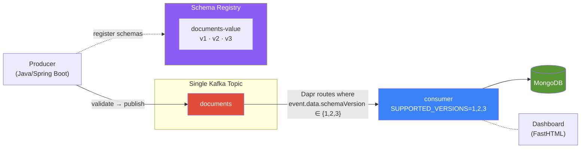
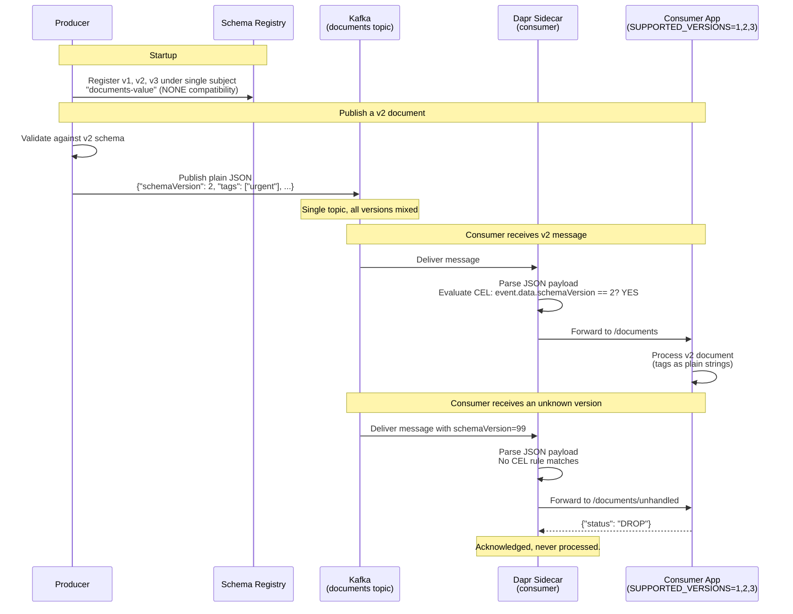
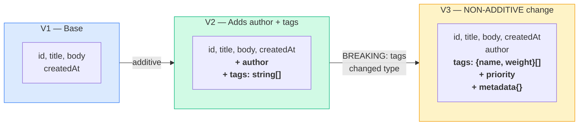
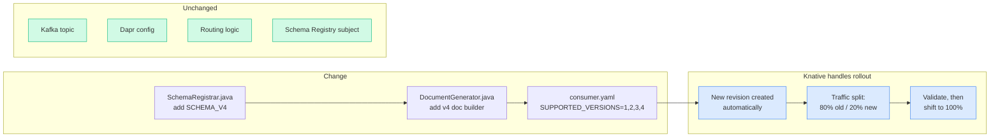

# Multi-Version Microservice Demo

Run **multiple versioned microservices** that handle evolving document schemas
on a **single Kafka topic** — with **Dapr** doing content-based routing and
**Schema Registry** tracking schema evolution (including non-additive changes).

A **single consumer deployment** handles all schema versions, and **Knative**
provides revision management and traffic splitting for safe rollouts.

> **TL;DR** &mdash; `docker compose up --detach` and open the live dashboard
> to watch the unified consumer process documents in real time.

---

## How It Works



**Key points:**
- **One Kafka topic** for all schema versions — no topic-per-version
- **One consumer** handles all versions via `SUPPORTED_VERSIONS=1,2,3`
- **Dapr inspects the payload** (`event.data.schemaVersion`) and routes matching versions to `/documents`, everything else to `/documents/unhandled`
- **Non-additive changes are safe** — V3 changes `tags` from `string[]` to `{name, weight}[]` objects. The consumer generates CEL rules for each supported version.
- **Schema Registry** uses a single subject with NONE compatibility — tracks evolution, doesn't block it

---

## How Versioned Services Work (Multi-Version Pattern)

Instead of deploying one consumer per schema version, a **single consumer** declares all versions it supports:

```
SUPPORTED_VERSIONS=1,2,3
```

At startup the consumer auto-generates Dapr CEL routing rules:

| Rule | Target |
|------|--------|
| `event.data.schemaVersion == 1` | `/documents` |
| `event.data.schemaVersion == 2` | `/documents` |
| `event.data.schemaVersion == 3` | `/documents` |
| *(default)* | `/documents/unhandled` (DROP) |

All three rules live inside the **same consumer pod**. Dapr delivers every message from the Kafka topic, the consumer processes the ones it knows, and drops the rest.

---

## Smart Routing (The Core Mechanism)



### What Makes This "Smart"

The routing rules are **auto-generated from config** — not hardcoded:

```java
// Consumer reads SUPPORTED_VERSIONS env var and generates CEL rules
for (int v : supportedVersions) {
    rules.add(Map.of(
        "match", "event.data.schemaVersion == " + v,  // inspects actual payload
        "path", "/documents"
    ));
}
// Everything else → /documents/unhandled → DROP
```

| What | Where it happens |
|------|-----------------|
| Schema validation | Producer validates against Schema Registry before publishing |
| Version discriminator | `schemaVersion` field in the JSON payload (not Kafka headers, not topic names) |
| Routing decision | Dapr sidecar parses JSON, evaluates CEL expression on `event.data.schemaVersion` |
| Drop non-matching | Dapr forwards to `/documents/unhandled` → app returns `DROP` → acknowledged, not processed |
| Service logic | Consumer only sees payloads for versions it declared. No defensive filtering in app code. |

---

## Schema Evolution (Including Non-Additive Changes)



**V3 is intentionally non-additive** to demonstrate the pattern:

| Field | V2 | V3 |
|-------|----|----|
| `tags` | `["urgent", "batch"]` (string array) | `[{"name":"urgent","weight":0.8}]` (object array) |

Even though V2 and V3 have incompatible `tags` types, the **single consumer handles both safely** because Dapr routes each version to the correct handler path based on the CEL rules.

All three schemas are registered under **one Schema Registry subject** (`documents-value`) with **NONE compatibility** mode, because Dapr routing provides the safety that would normally come from BACKWARD compatibility rules.

---

## Adding a V4 (with Knative Canary Rollout)



Steps to add V4:

1. Add `SCHEMA_V4` to `SchemaRegistrar.java`
2. Add v4 document builder to `DocumentGenerator.java`
3. Change `SUPPORTED_VERSIONS` from `"1,2,3"` to `"1,2,3,4"` in the consumer deployment
4. Deploy — Knative automatically creates a new revision
5. Split traffic (e.g. 80/20) between old and new revisions for canary validation
6. Once validated, shift 100% to the new revision

No new deployments, no new services, no Kafka/Dapr changes. One config change.

---

## Quick Start

**Prerequisites:** Docker and Docker Compose (v2.20+).

```bash
# Clone with submodules
git clone --recurse-submodules https://github.com/righteouslabs/experiments-kubernetes.git
cd experiments-kubernetes

# Start everything (MicroShift + build + deploy)
docker compose up --detach

# Watch deployment progress
docker compose logs -f cluster-deploy

# Once deployed, open the dashboard
export KUBECONFIG=$(pwd)/microshift-docker-compose/kubeconfig
kubectl -n versioned-demo port-forward svc/dashboard 5001:5001
# → open http://localhost:5001
```

### Watch Logs

```bash
# Producer
kubectl -n versioned-demo logs -l app=producer -c producer -f

# Consumer (all versions)
kubectl -n versioned-demo logs -l app=consumer -c consumer -f
```

### Check Consumer Stats

```bash
kubectl -n versioned-demo exec deploy/consumer -c consumer -- curl -s localhost:8080/status
```

### Standalone Mode (No Kubernetes)

```bash
docker compose -f docker-compose.standalone.yml up --build
# Dashboard: http://localhost:5001
```

### Tear Down

```bash
docker compose down -v
```

---

## Project Structure

```
.
├── docker-compose.yml              # MicroShift + automated deployment
├── docker-compose.standalone.yml   # Plain Docker alternative
├── dashboard/                      # FastHTML live dashboard
│   ├── Dockerfile
│   └── app.py
├── producer/                       # Java producer
│   └── src/.../producer/
│       ├── DocumentGenerator.java  # Publishes plain JSON, Dapr wraps in CloudEvents
│       └── SchemaRegistrar.java    # Registers schemas under single SR subject
├── consumer-service/               # Java consumer (multi-version)
│   └── src/.../consumer/
│       └── controller/
│           └── SubscriptionController.java  # Dapr CEL routing + version-specific handlers
├── dapr/components/                # Dapr component YAML (Kafka pub/sub, MongoDB state)
├── schemas/                        # JSON Schema files (v1, v2, v3)
├── k8s/                            # Kubernetes manifests
│   ├── infrastructure/             # ZooKeeper, Kafka, Schema Registry, MongoDB
│   ├── dapr/                       # Dapr placement + components ConfigMap
│   ├── services/                   # Producer, consumer (unified), dashboard
│   │   ├── producer.yaml
│   │   ├── consumer.yaml           # Single consumer: SUPPORTED_VERSIONS=1,2,3
│   │   └── dashboard.yaml
│   └── knative/                    # Knative Service with revision/traffic-split pattern
│       └── consumer-ksvc.yaml
└── microshift-docker-compose/      # Git submodule: MicroShift in Docker
```

## Key Technologies

| Component | Role |
|-----------|------|
| [Confluent Kafka](https://www.confluent.io/) + [Schema Registry](https://docs.confluent.io/platform/current/schema-registry/) | Single-topic event streaming + schema catalog |
| [Dapr](https://dapr.io/) | Content-based pub/sub routing (CEL on payload), state store |
| [MongoDB](https://www.mongodb.com/) | Document persistence via Dapr state store |
| [MicroShift](https://microshift.io/) | Lightweight OpenShift/K8s (via Docker Compose) |
| [Knative Serving](https://knative.dev/) | Revision management + traffic splitting for canary rollouts |
| Java 17 / Spring Boot 3 | Microservice runtime |
| Python / [FastHTML](https://fastht.ml/) | Live pipeline dashboard |

---

## Design Decisions

### Why a Single Multi-Version Consumer?

Instead of deploying N consumers for N schema versions:

| Per-version consumers | Multi-version consumer |
|-----------------------|----------------------|
| N pods, N Dapr sidecars, N services | 1 pod, 1 Dapr sidecar, 1 service |
| Adding V4 = new deployment + service + config | Adding V4 = change one env var |
| Resource usage scales with version count | Resource usage stays constant |
| Knative: N separate services to manage | Knative: 1 service with revision-based rollout |

The consumer code already handles multiple versions via `SUPPORTED_VERSIONS` — no reason to run separate pods.

### Why NONE Compatibility in Schema Registry?

Schema Registry normally enforces BACKWARD or FORWARD compatibility between
versions of the same subject. We set NONE because **Dapr routing replaces
compatibility as the safety mechanism**:

| Traditional approach | This demo |
|---------------------|-----------|
| BACKWARD compat ensures new consumers read old data | Dapr routing ensures consumers only see their version |
| Limits schema changes to additive-only | Allows breaking changes (V3 changes `tags` type) |
| Safety at serialization layer | Safety at routing layer |

Both are valid — this demo shows the routing-based approach for cases where
versions have fundamentally different business logic.

### Why Not Topic-Per-Version?

Topic proliferation (one topic per schema version) doesn't scale:
- More topics = more partitions = more broker overhead
- Consumer groups multiply
- Operational complexity increases linearly with versions

A single topic with content-based routing scales to any number of versions
without infrastructure changes.

---

## OpenShift / MicroShift Notes

The deployer automatically handles these OpenShift-specific requirements:
- **SCC binding** — `privileged` + `anyuid` SCCs for infrastructure images
- **`enableServiceLinks: false`** — prevents Confluent env var collisions
- **`securityContext.runAsUser: 0`** — Confluent images require root

---

## License

MIT
