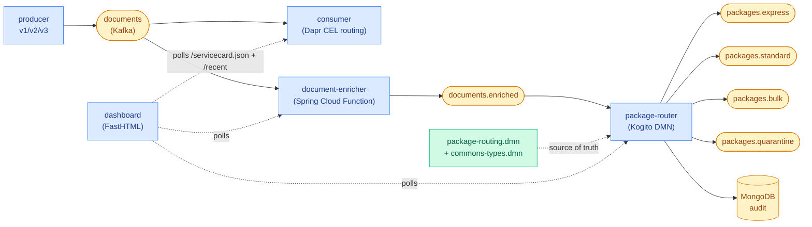
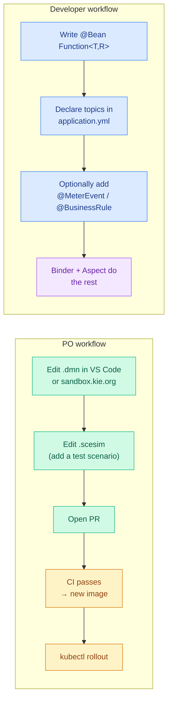
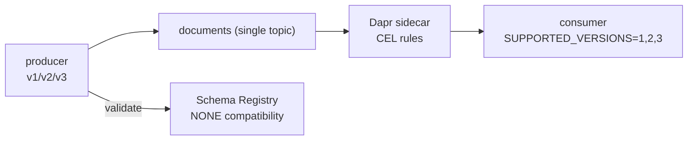

# A Lean Microservice Fleet for a Manufacturing Demo

Four Spring Boot services, one FastHTML dashboard, one Grafana stack —
all wired together to prove that **business logic can live outside the
code** and **frameworks can carry the boilerplate**.

> `docker compose up --build --detach` — then open
> [http://localhost:30501](http://localhost:30501).

---

## Problem

Most enterprise Java services look like this:

- Business rules are buried five packages deep, in branching `if` trees
  that only a developer can read or change.
- Each service hand-rolls its own Kafka client, its own retry loop, its
  own log format, its own metric names.
- A Product Owner who wants to change a routing threshold has to file a
  ticket, wait on a developer, review a Java diff, and trust that the
  new build behaves.
- Evolving schemas — even additively — breaks consumers because shape
  lives in scattered `Map<String, Object>` blobs.

This demo flips that story:

- **DMN decision tables are the source of truth for business logic.**
  Product Owners edit them directly, in VS Code or a web sandbox.
- **Frameworks handle boilerplate.** Spring Cloud Stream owns Kafka,
  Spring Boot Actuator + Micrometer own observability, AspectJ owns
  cross-cutting counters, Kogito/Apache KIE owns rule evaluation.
- **A single shared library** —
  [`commons-observability/`](./commons-observability/) — provides the
  three annotations (`@MeterEvent`, `@BusinessRule`, `@Tick`),
  the `ProcessContext` thread-local, and one AspectJ advice class.
  Every service reuses them; no service copies them.
- **A single shared types DMN file** —
  [`commons-types.dmn`](./package-router/src/main/resources/dmn/commons-types.dmn) —
  declares `Document`, `EnrichedDocument` and `PackageRoute`. Rule
  files `<import>` it so types stay aligned.

---

## Before / After

| Concern                    | Hand-rolled Java                         | Framework-managed here                                          |
|----------------------------|------------------------------------------|-----------------------------------------------------------------|
| Kafka consumer/producer    | `KafkaConsumer` + poll loop + commits    | Spring Cloud Stream binder + `@Bean Function<T,R>`              |
| Routing rules              | Nested `if / else` in a service class    | DMN decision table in a `.dmn` file                             |
| Message envelope           | Custom unwrap + validation methods       | One `CloudEventEnvelope.unwrap` helper, shared                  |
| Counters                   | `meterRegistry.counter(...).increment()` everywhere | `@MeterEvent("EVENT_NAME")` on the method                       |
| Structured logs            | `MDC.put(...)` scattered in callers      | `ProcessContext` try-with-resources + aspect emits one line     |
| Tag cardinality safety     | Hope and prayer                          | `observability.tags.<name>.allow` allow-list in YAML            |
| PO view of business logic  | "Ask a developer"                        | `/servicecard.json` renders the live DMN table + test scenarios |
| Tests                      | Integration-only                         | DMN + `.scesim` + `.feature` — three layers, three owners       |

---

## The fleet


*System-wide flow: the green node is owned by POs, blue by developers, amber is shared infrastructure / topics.*

Three Kafka pipelines co-exist on the same broker:

1. **Versioned routing (Phase 0)** — `producer` → `documents` →
   Dapr CEL → `consumer`. Demonstrates `SUPPORTED_VERSIONS=1,2,3` and
   content-based routing.
2. **Low-code enrichment (Phase 1)** —
   [`lowcode-scf/`](./lowcode-scf/): the AsyncAPI spec is the contract,
   the Function bean is ~10 lines.
3. **Low-code routing (Phase 2)** —
   [`package-router/`](./package-router/): the DMN table is the
   business logic, Java is a ~75-LOC carrier.

---

## Workflows by role


*Two roles, two tool sets. The PO never opens Java; the developer never hand-rolls a Kafka client.*

---

## Per-folder READMEs

| Where                                                                                    | What                                         | Audience         |
|------------------------------------------------------------------------------------------|----------------------------------------------|------------------|
| [`lowcode-scf/`](./lowcode-scf/README.md)                                                | Spring Cloud Function enrichment stage       | Devs (PO intro)  |
| [`package-router/`](./package-router/README.md)                                          | DMN routing stage                            | POs & Devs       |
| [`package-router/src/main/resources/dmn/`](./package-router/src/main/resources/dmn/README.md) | The `.dmn` + `.scesim` files               | POs              |
| [`package-router/src/test/`](./package-router/src/test/README.md)                        | Three-layer test pattern                     | Devs             |
| [`commons-observability/`](./commons-observability/README.md)                            | Shared annotations + aspect + helpers        | Devs             |
| [`dashboard/`](./dashboard/README.md)                                                    | FastHTML live dashboard + Service Cards      | POs & Devs       |
| [`k8s/`](./k8s/README.md)                                                                | Deployment topology                          | Devs / Ops       |

---

## Quick start

**Prerequisites:** Docker + Docker Compose v2.20+.

```bash
git clone --recurse-submodules https://github.com/righteouslabs/experiments-kubernetes.git
cd experiments-kubernetes

# One command: MicroShift + image builds + deploy + observability.
docker compose up --build --detach

# Watch progress
docker compose logs -f cluster-deploy

# Dashboard, Service Cards, Grafana
open http://localhost:30501
open http://localhost:30501/service-card/document-enricher
open http://localhost:30501/service-card/package-router
open http://localhost:3000
```

### Teardown

```bash
docker compose down --volumes
```

---

## Phase 0: versioned routing (legacy demo)

Phase 0 is the original chapter of the demo — **one consumer, all
schema versions**. Dapr inspects `event.data.schemaVersion` on the
payload and routes to `/documents` for declared versions, dropping the
rest.


*Schema evolution pattern: one subject, N versions, routing replaces compatibility.*

| What                      | Where                                                                      |
|---------------------------|----------------------------------------------------------------------------|
| Payload-based routing     | Dapr CEL on `event.data.schemaVersion`                                     |
| Schema evolution          | Single `documents-value` subject with `NONE` compatibility                 |
| Version fan-in            | Single consumer declares `SUPPORTED_VERSIONS=1,2,3`; unknown → DROP        |
| Canary rollouts           | Knative Service revision + traffic splitting (see `k8s/knative/`)          |

Breaking change story: V3 changes `tags` from `string[]` to
`{name, weight}[]`. V2 consumers keep reading V2 traffic; only V3-aware
logic sees V3. One topic. One consumer deployment. Env-var flip to add V4.

---

## Phase 1: low-code enrichment

The spec-first path —
[`lowcode-scf/asyncapi.yaml`](./lowcode-scf/asyncapi.yaml) is the
contract, the Function body is the application. See
[`lowcode-scf/README.md`](./lowcode-scf/README.md) for the details.

---

## Phase 2: rule-as-source-of-truth

A DMN decision table is the business logic. Java is ~75 LOC of carrier.
POs edit the `.dmn` file directly; a DMN Runtime Event Listener captures
which rows fired for every message and writes an audit record. See
[`package-router/README.md`](./package-router/README.md).

---

## Key technologies

| Component                          | Role                                                           |
|------------------------------------|----------------------------------------------------------------|
| Apache Kafka + Schema Registry     | Event streaming + schema catalog                               |
| Spring Cloud Stream Kafka binder   | Kafka I/O declared in YAML, not Java                           |
| Spring Cloud Function              | `@Bean Function<T,R>` ≡ one service                            |
| Apache KIE / Kogito DMN 1.5        | Runtime for the .dmn files                                     |
| Dapr                               | Content-based pub/sub routing (Phase 0)                        |
| Knative Serving                    | Revision management + canary traffic (Phase 0)                 |
| KEDA                               | Kafka-lag autoscaling (document-enricher)                      |
| Micrometer + Prometheus + Grafana  | KPIs and dashboards                                            |
| AspectJ                            | Single advice class drives all metric + log emission           |
| Spring Data MongoDB                | Per-decision audit ledger                                      |
| MicroShift                         | OpenShift-compatible Kubernetes in Docker                      |
| FastHTML                           | Live dashboard + Service Cards                                 |

---

## Design decisions

### Why DMN for the routing rules?

Because "the PO can change the table" is a real, measurable win — not
marketing. A DMN edit is a structured diff: a new row, a changed
condition, a tweaked SLA. A Java diff is unstructured; it can hide
wiring changes next to logic changes. See
[`package-router/src/main/resources/dmn/README.md`](./package-router/src/main/resources/dmn/README.md)
for the PO workflow.

### Why a shared `commons-observability` library?

Because the moment a second service appeared (`lowcode-scf` →
`package-router`), the alternative was either duplication or a silent
divergence of metric names. The library is intentionally tiny — two
annotations, one interface pair, one aspect. If it grows beyond that
it's doing too much.

### Why NOT hand-roll deserialization?

A Jackson deserializer that strips CloudEvents envelopes is a
six-liner. Both services now share one — `CloudEventEnvelope.unwrap` in
commons — so there is exactly one place that understands the envelope.
If Dapr switches away tomorrow, we delete one import from each service.

### Why a `.scesim` AND a `.feature`?

Each layer proves a different thing and is owned by a different role.
The `.scesim` is the PO's unit test for the DMN rule; the `.feature` is
the developer's integration test for the surrounding Kafka +
Micrometer + MongoDB plumbing. See
[`package-router/src/test/README.md`](./package-router/src/test/README.md).

---

## OpenShift / MicroShift notes

The deployer binds the `privileged` + `anyuid` SCCs to the default
service account, uses `enableServiceLinks: false` to avoid Confluent's
env-var collisions, and runs infrastructure images with
`runAsUser: 0` where required.

---

## License

MIT
