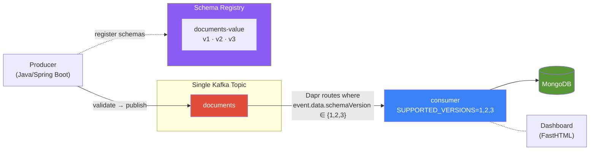
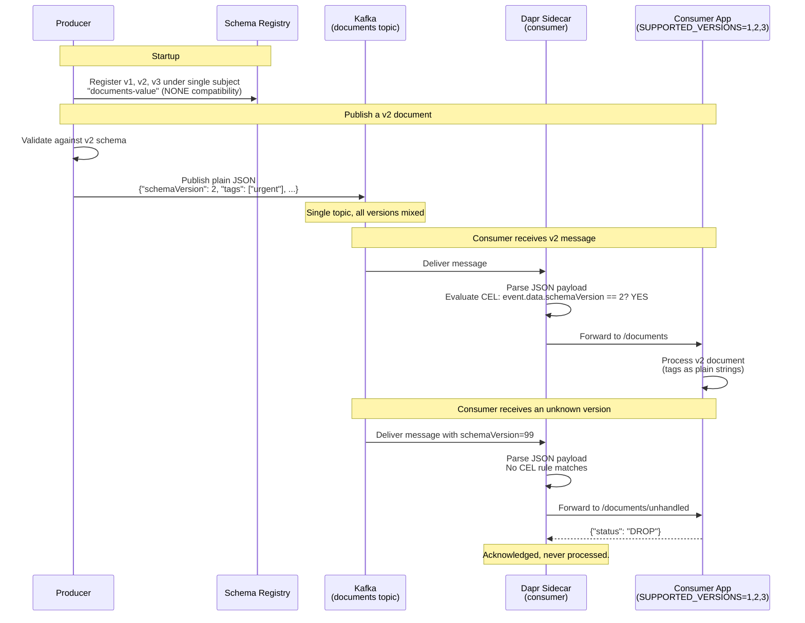
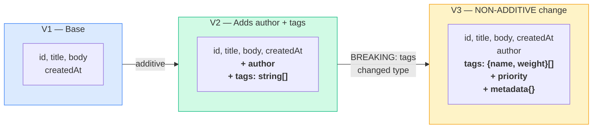
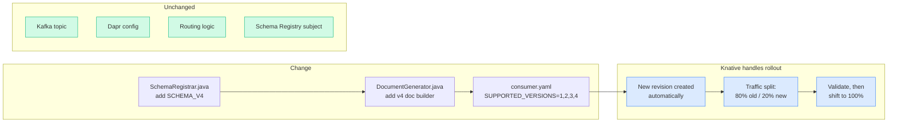
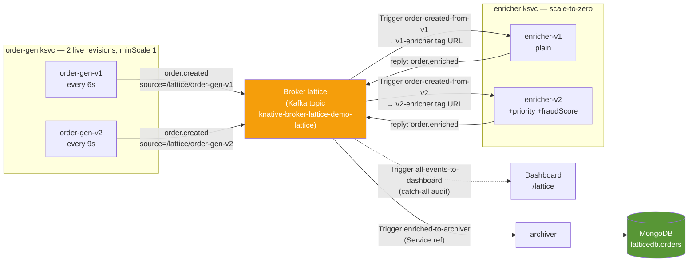
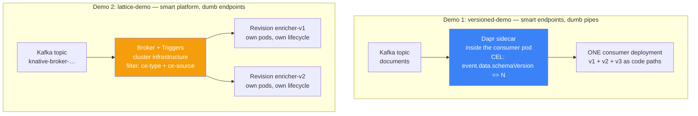
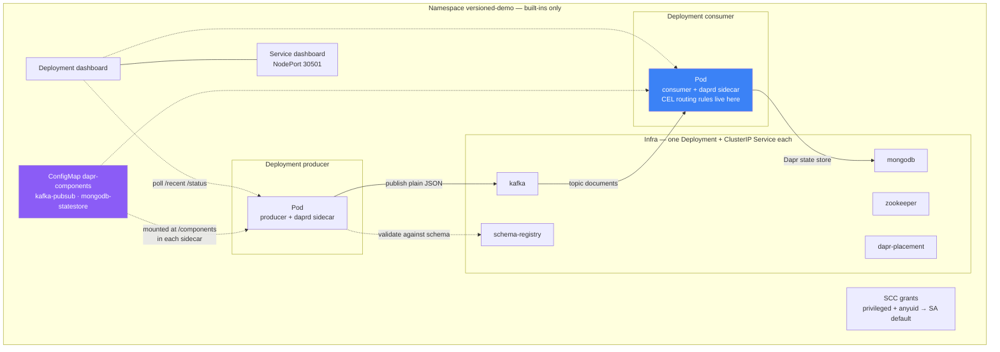
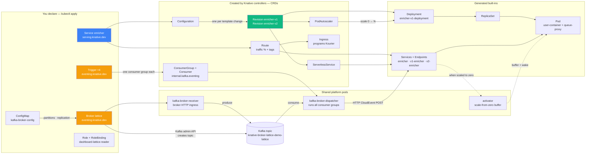

# Multi-Version Microservice Demos

Two demos, side by side on **one MicroShift cluster**, brought up by a single
`docker compose up`:

| # | Demo | Namespace | What it shows |
|---|------|-----------|---------------|
| 1 | **Dapr content-based routing** | `versioned-demo` | Multiple schema versions on a **single Kafka topic** — Dapr routes by payload, Schema Registry tracks evolution (including non-additive changes), one consumer handles all versions |
| 2 | **Microservice lattice (Knative Eventing)** | `lattice-demo` | Version-to-version event edges declared as **Triggers**, not service config — rewire an edge live with one `kubectl patch` |

> **TL;DR** &mdash; `docker compose up --detach`, then open the live dashboard:
> [http://localhost:30501](http://localhost:30501) for Dapr routing,
> [http://localhost:30501/lattice](http://localhost:30501/lattice) for the Knative lattice.

The next sections cover Demo 1; Demo 2 is documented in
[Microservice Lattice (Knative Eventing)](#microservice-lattice-knative-eventing),
and the two approaches are compared head-to-head — including how each behaves
at 100+ services — in
[Architecture Comparison](#architecture-comparison-two-ways-to-run-many-versions).

---

## How It Works



**Key points:**
- **One Kafka topic** for all schema versions — no topic-per-version
- **One consumer** handles all versions via `SUPPORTED_VERSIONS=1,2,3`
- **Dapr inspects the payload** (`event.data.schemaVersion`) and routes matching versions to `/documents`, everything else to `/documents/unhandled`
- **Non-additive changes are safe** — V3 changes `tags` from `string[]` to `{name, weight}[]` objects. The consumer generates CEL rules for each supported version.
- **Schema Registry** uses a single subject with NONE compatibility — tracks evolution, doesn't block it

---

## How Versioned Services Work (Multi-Version Pattern)

Instead of deploying one consumer per schema version, a **single consumer** declares all versions it supports:

```
SUPPORTED_VERSIONS=1,2,3
```

At startup the consumer auto-generates Dapr CEL routing rules:

| Rule | Target |
|------|--------|
| `event.data.schemaVersion == 1` | `/documents` |
| `event.data.schemaVersion == 2` | `/documents` |
| `event.data.schemaVersion == 3` | `/documents` |
| *(default)* | `/documents/unhandled` (DROP) |

All three rules live inside the **same consumer pod**. Dapr delivers every message from the Kafka topic, the consumer processes the ones it knows, and drops the rest.

---

## Smart Routing (The Core Mechanism)



### What Makes This "Smart"

The routing rules are **auto-generated from config** — not hardcoded:

```java
// Consumer reads SUPPORTED_VERSIONS env var and generates CEL rules
for (int v : supportedVersions) {
    rules.add(Map.of(
        "match", "event.data.schemaVersion == " + v,  // inspects actual payload
        "path", "/documents"
    ));
}
// Everything else → /documents/unhandled → DROP
```

| What | Where it happens |
|------|-----------------|
| Schema validation | Producer validates against Schema Registry before publishing |
| Version discriminator | `schemaVersion` field in the JSON payload (not Kafka headers, not topic names) |
| Routing decision | Dapr sidecar parses JSON, evaluates CEL expression on `event.data.schemaVersion` |
| Drop non-matching | Dapr forwards to `/documents/unhandled` → app returns `DROP` → acknowledged, not processed |
| Service logic | Consumer only sees payloads for versions it declared. No defensive filtering in app code. |

---

## Schema Evolution (Including Non-Additive Changes)



**V3 is intentionally non-additive** to demonstrate the pattern:

| Field | V2 | V3 |
|-------|----|----|
| `tags` | `["urgent", "batch"]` (string array) | `[{"name":"urgent","weight":0.8}]` (object array) |

Even though V2 and V3 have incompatible `tags` types, the **single consumer handles both safely** because Dapr routes each version to the correct handler path based on the CEL rules.

All three schemas are registered under **one Schema Registry subject** (`documents-value`) with **NONE compatibility** mode, because Dapr routing provides the safety that would normally come from BACKWARD compatibility rules.

---

## Adding a V4 (with Knative Canary Rollout)



Steps to add V4:

1. Add `SCHEMA_V4` to `SchemaRegistrar.java`
2. Add v4 document builder to `DocumentGenerator.java`
3. Change `SUPPORTED_VERSIONS` from `"1,2,3"` to `"1,2,3,4"` in the consumer deployment
4. Deploy — Knative automatically creates a new revision
5. Split traffic (e.g. 80/20) between old and new revisions for canary validation
6. Once validated, shift 100% to the new revision

No new deployments, no new services, no Kafka/Dapr changes. One config change.

---

## Microservice Lattice (Knative Eventing)

The second demo (namespace `lattice-demo`) turns service wiring inside out.
Services only emit and receive **CloudEvents** — the version-to-version edges
live in **Knative Triggers** (filter on `type` + `source` → a pinned
tagged-revision URL or Service ref), not in any service's Kafka config.
Producers stamp their identity from `K_REVISION` into `ce-source`, so every
event says *which revision* emitted it. Rewiring an edge is **one Trigger
patch** — no rebuilds, no redeploys, no consumer-group churn.

One Spring Cloud Function app (`lattice/functions/`, image
`dev.local/lattice-functions:v1`) plays all three roles, selected by env:

| Role | Selected by | Behavior |
|------|-------------|----------|
| order-gen | `ORDER_GEN_ENABLED=true` | `@Scheduled` emitter — POSTs `lattice.order.created` CloudEvents to the Broker with `ce-source=/lattice/<K_REVISION>` |
| enrich | `SPRING_CLOUD_FUNCTION_DEFINITION=enrich` | Function — adds `enrichedBy`/`enrichedAt`, replies `lattice.order.enriched`; `ENRICH_MODE=scored` also adds `priority` + `fraudScore` |
| archive | `SPRING_CLOUD_FUNCTION_DEFINITION=archive` | Consumer — persists orders to MongoDB `latticedb.orders` |

The Broker `lattice` (Kafka class) reuses the existing Kafka: topic
`knative-broker-lattice-demo-lattice` is auto-created, and **each Trigger gets
its own consumer group**.



`order-gen` runs **two revisions side by side** (both `minScale: 1` — emitters
are self-driven, not request-driven). The enricher and archiver use
`minScale: 0` and scale to zero between events. Validated live: enricher-v1
received *only* order-gen-v1 events, enricher-v2 only v2's.

### Quick Start (Lattice)

The same `docker compose up --detach` deploys both demos — `cluster-deploy`
installs Knative v1.22 (Serving + Kourier + Eventing + Kafka Broker) in step
`[8/9]` and the lattice in `[9/9]`. Open **http://localhost:30501/lattice**
(dashboard NodePort — no port-forward): a live topology graph (nodes =
revisions from the k8s API, edges = Triggers labeled with their filters,
highlighted when active in the last 10s) plus a live event table fed by the
catch-all Trigger.

```bash
export KUBECONFIG=$(pwd)/microshift-docker-compose/kubeconfig

# The lattice: services, broker, edges
kubectl -n lattice-demo get ksvc,broker,trigger

# Watch each role
kubectl -n lattice-demo logs -l serving.knative.dev/service=order-gen -c user-container -f
kubectl -n lattice-demo logs -l serving.knative.dev/service=enricher  -c user-container -f
kubectl -n lattice-demo logs -l serving.knative.dev/service=archiver  -c user-container -f

# Archived orders, grouped by which enricher revision touched them
kubectl -n versioned-demo exec deploy/mongodb -- mongosh --quiet latticedb \
  --eval 'db.orders.aggregate([{$group:{_id:"$enrichedBy",count:{$sum:1}}}]).toArray()'
```

### Rewire an Edge Live

The `order-created-from-v1` Trigger pins v1 producer events to enricher-v1.
Point it at enricher-v2 instead — one patch, no redeploys:

```bash
kubectl -n lattice-demo patch trigger order-created-from-v1 --type merge \
  -p '{"spec":{"subscriber":{"uri":"http://v2-enricher.lattice-demo.svc.cluster.local"}}}'
```

Within ~30s the enricher-v2 logs show it enriching order-gen-v1's orders
(`producedBy=order-gen-v1`, `enrichedBy=enricher-v2`) and the `/lattice` UI
edge re-targets. The consumer group is untouched. Revert:

```bash
kubectl -n lattice-demo patch trigger order-created-from-v1 --type merge \
  -p '{"spec":{"subscriber":{"uri":"http://v1-enricher.lattice-demo.svc.cluster.local"}}}'
```

### Add a v3 Enricher

The extension story — Kafka, Broker, and every other service stay untouched:

1. Edit `lattice/functions/` with the new behavior (e.g. a new `ENRICH_MODE`)
2. Build and load the image into MicroShift's CRI-O:
   ```bash
   docker build -t dev.local/lattice-functions:v2 lattice/functions
   docker save dev.local/lattice-functions:v2 | docker exec -i microshift podman load
   ```
3. Copy `k8s/lattice/21-enricher-v2.yaml` → `22-enricher-v3.yaml`: set the
   template name to `enricher-v3`, point at the new image, and add a third
   traffic entry with `tag: v3` (keep the v1/v2 entries — **one `kubectl apply`
   creates one revision**, which is why the compose deploy stages two applies
   per multi-revision service)
4. `kubectl apply -f k8s/lattice/22-enricher-v3.yaml`, wait for the revision
   to be Ready
5. Route to it: add a pinned Trigger edge to
   `http://v3-enricher.lattice-demo.svc.cluster.local`, **or** shift traffic
   `percent` on the `enricher` ksvc for a canary — the `enriched-to-archiver`
   edge already follows the split via its Service ref

> **Never rename a Trigger** — the Trigger name *is* the Kafka consumer-group
> identity. Rewire by patching `spec.subscriber`; offsets stay intact.

### How It Maps to the Design

| Design concept | Knative object |
|----------------|----------------|
| Lattice edge | `Trigger` (filter `type` + `source` → subscriber) |
| Service version | `Revision` |
| Stable handle to a version | traffic `tag` → `<tag>-<service>` URL |
| Producer identity | `K_REVISION` env → `ce-source` |
| Canary rollout | traffic `percent` split |
| Audit tap | catch-all Trigger → dashboard `/lattice/events` |
| Delivery safety | Broker `delivery`: 5 retries, exponential backoff |

---

## Architecture Comparison: Two Ways to Run Many Versions

Both demos solve the same problem — **many versions live simultaneously on one
Kafka backbone** — but they put the routing intelligence in opposite places:



- **Demo 1** — the routing table ships *inside the application*: the consumer
  generates its CEL rules from `SUPPORTED_VERSIONS` and hands them to its
  sidecar at startup. To know what routes where, you ask the app.
- **Demo 2** — the routing table *is cluster state*: Triggers are CRDs that
  exist independently of any service. To know what routes where, you ask the
  API server (`kubectl get triggers` — the `/lattice` dashboard page is
  literally a rendering of that query).

### Kubernetes Resource Anatomy

Same Kafka, same MongoDB, same kind of Java workload — radically different
resource graphs.

**Demo 1 is built entirely from Kubernetes built-ins — zero CRDs.**
8 Deployments, 8 Services, 1 ConfigMap, plus SCC grants. Every behavior
(routing, retries, state access) lives in containers you run; Kubernetes just
schedules them:



**Demo 2 declares 5 things and gets ~20 —** you apply three `Knative
Service`s, one `Broker`, four `Trigger`s (plus a ConfigMap and RBAC); a chain
of controllers expands them into intermediate CRDs, then into plain built-ins,
then into a Kafka topic:



Who creates what, and why it exists:

| Resource | API group | Created by | Role in the machine |
|---|---|---|---|
| `Service` (ksvc) | serving.knative.dev | **you** | desired state: image, env, traffic split |
| `Configuration` | serving.knative.dev | Serving controller | version history; stamps a Revision per template change |
| `Revision` | serving.knative.dev | Serving controller | **immutable snapshot = a version**; the lattice's nodes |
| `Route` | serving.knative.dev | Serving controller | traffic % across revisions + tag URLs (`v1-enricher…`) |
| `PodAutoscaler` | autoscaling.internal.knative.dev | Serving controller | KPA — request-driven scaling incl. zero |
| `ServerlessService` | networking.internal.knative.dev | Serving controller | flips Service endpoints between activator (at zero) and pods |
| `Ingress` | networking.internal.knative.dev | Serving controller | programs the Kourier gateway |
| `Broker` | eventing.knative.dev | **you** | one Kafka topic + one HTTP ingress for events |
| `Trigger` | eventing.knative.dev | **you** | **one lattice edge = one consumer group**; filter → subscriber |
| `ConsumerGroup` / `Consumer` | internal.kafka.eventing.knative.dev | Kafka controller | materialized consumer-group state the dispatcher runs |
| `ConfigMap` kafka-broker-config | core | **you** | partitions, replication, bootstrap — the "topic request form" as YAML |
| `Deployment` / `ReplicaSet` / `Pod` / `Service` / `Endpoints` | apps / core | k8s controllers | the actual compute and networking, one set per revision |
| `Role` / `RoleBinding` | rbac.authorization.k8s.io | **you** | lets the dashboard read the topology it draws |
| `SecurityContextConstraints` | security.openshift.io | MicroShift (patched by deploy) | UID grants: `nonroot-v2` for Kourier + Kafka data plane |

The punchline of the two diagrams: in Demo 1 the interesting behavior hides
*inside containers* (sidecar config, app code); in Demo 2 it's spread across
*API objects* — which is exactly what makes it queryable, diffable, and
governable, at the cost of more machinery.

### Implementation Specifics, Side by Side

| Concern | versioned-demo (Dapr) | lattice-demo (Knative Eventing) |
|---|---|---|
| Who consumes Kafka | a `daprd` sidecar in **every** consumer pod | one shared `kafka-broker-dispatcher` (platform) |
| Routing decision | CEL on the **payload** (`event.data.schemaVersion == 2`), in the sidecar | CloudEvent **attribute** filter (`type` + `source`), in the broker |
| Version identity | `schemaVersion` field inside the JSON body | immutable Revision; `K_REVISION` stamped into `ce-source` |
| Where versions run | one deployment, all versions as code paths | one pod-set per revision, independently scheduled |
| Add a version | edit `SUPPORTED_VERSIONS`, redeploy the consumer | `kubectl apply` a new revision; existing ones untouched |
| Roll back a version | redeploy previous image/config | flip traffic `percent` / delete one Trigger edge |
| Canary / shadow | none — all versions share one process | traffic split %, or a shadow Trigger (a free full copy of the stream — it's just another consumer group) |
| Autoscaling | HPA / static replicas | KPA request-driven, **scale-to-zero** (enricher + archiver here) |
| Consumer groups | one per app, managed by the sidecar | one per Trigger, owned by the platform |
| Unknown versions | app implements `/unhandled` → `DROP` | no matching Trigger → **silently dropped**; this demo adds a catch-all audit Trigger |
| Kafka topics | pre-created / auto by client | **CRD side effect** — the Broker creates and owns its topic |
| Topology discovery | read every app's config | `kubectl get triggers` (or the live `/lattice` graph) |
| Runs without Kubernetes | yes — `docker-compose.standalone.yml` | no — Knative *is* the platform |

### Trade-offs

**Demo 1 — Dapr content-based routing**

| 👍 Strengths | 👎 Costs |
|---|---|
| Minimal platform: sidecars + one placement pod | Routing rules are invisible infrastructure — the topology lives in N app configs |
| Routes on **any payload field**, not just envelope attributes | A sidecar in every consumer pod (~50–120 MB each — a real tax at fleet scale) |
| N versions ≈ zero marginal infrastructure (one env var) | All versions share one process: no per-version scaling, rollback, or canary |
| Portable — same code runs in plain Docker | One bad version's bug takes down the pod serving **all** versions (shared blast radius) |
| Simple mental model for a small team | Static/CPU scaling can't see queue depth; no scale-to-zero |

**Demo 2 — Knative Eventing lattice**

| 👍 Strengths | 👎 Costs |
|---|---|
| Topology is declarative, queryable cluster state — diffable in PRs, lintable in CI (Kyverno/Conftest) | Heavy platform: ~12 Knative control/data-plane pods to operate and upgrade |
| Versions are immutable revisions: independent scale, instant rollback, tagged URLs, % canaries | Pinned edges grow as **E × P** (edges × producer versions) if you never collapse them |
| Rewire an edge with one `kubectl patch` — ~30 s, no redeploys (validated live) | Filters see CloudEvent attributes only — payload-content routing needs CESQL or an attribute promoted into the envelope |
| Scale-to-zero consumers; autoscaler sees actual request flow | **Trigger name = consumer-group identity** — renaming one silently resets offsets |
| Platform owns consumer groups, offsets, retries — zero Kafka client code in services | At-least-once + overlapping filters = double processing; version filters must be mutually exclusive |
| Topics born from CRDs — the "ticket to get a topic" workflow disappears | JVM cold starts (~5–10 s) on scale-from-zero; `minScale: 1` trades idle cost for latency |
| Blast radius = one revision | Ordering is per-partition only; ordered delivery caps concurrency at partition count |

### At 100+ Services × Many Parallel Versions

The demos are 1 and 3 services; the trade-offs invert or amplify at fleet scale:

| Scaling dimension | Dapr-style (routing in app) | Lattice (routing in platform) |
|---|---|---|
| Per-consumer infra | +1 sidecar **per pod** → hundreds of sidecars, each metered | shared dispatcher pool — constant, amortized |
| "What talks to what?" | read 100+ app configs / codebases | one API query; always current, renderable (this repo's `/lattice` page) |
| Ship v(n+1) of one service | rebuild + redeploy that consumer | new revision + one Trigger patch or % shift |
| Fleet-wide rollout policy | convention + code review across 100 repos | admission policy on CRDs (e.g. "every Trigger must set a DLQ", "filters must be mutually exclusive") |
| Routing-rule sprawl | grows silently inside apps | explicit — visible enough to hurt: keep steady state at **E** edges (Service refs + traffic %), pin per-version edges only during validation |
| Failure isolation | deployment-level (all versions together) | revision-level |
| Team model | every team writes consumer/routing logic | platform team owns Broker; app teams own a function + a reviewable routes-table PR |

**Rules that keep a lattice healthy at fleet scale** (each maps to a sharp edge above):

1. **Pin edges transiently, collapse aggressively** — pinned `uri:` Triggers are for
   validating a version; steady state is `ref:` + traffic split, so edge count
   stays E, not E × P.
2. **Never rename a Trigger** — the name is the consumer group; rename = offset loss.
3. **Always run a catch-all audit Trigger** — unmatched events vanish silently otherwise.
4. **Keep version filters mutually exclusive** — overlap means double processing.
5. **Generate Triggers from a routes table** (Kustomize/Helm loop) rather than
   hand-writing hundreds of YAML files; review the table, not the files.
6. **Broker boundaries are throughput boundaries** — partitions are a Broker
   property, so a firehose stream and a trickle stream belong on different Brokers.

### So Which Is "Good Architecture"?

Both — for different shapes of the problem:

| Choose | When |
|---|---|
| **Dapr-style** | versions share one codebase and differ by schema handling; routing needs payload content; platform budget is small; you may need to run outside Kubernetes |
| **Lattice** | versions are independent deployables owned by many teams; you need canary/shadow/instant rollback per version; topology must be auditable; you can afford to operate the platform |
| **Both together** | they compose — this cluster runs Dapr for state-store access *and* Knative for the eventing lattice. Use each where its routing model fits. |

The deeper lesson: **the hard part is never the service code** (the enricher is
~40 lines). It's the *routing topology* — and the main architectural choice is
whether that topology lives implicitly in application config (cheap, opaque)
or explicitly in platform state (heavier, but visible, diffable, and
governable). At 100+ services, visibility usually wins.

---

## Quick Start

**Prerequisites:** Docker and Docker Compose (v2.20+). The MicroShift
container runs with a **16 GB memory limit** — give Docker at least that.

```bash
# Clone with submodules
git clone --recurse-submodules https://github.com/righteouslabs/experiments-kubernetes.git
cd experiments-kubernetes

# Start everything (MicroShift + build + deploy — both demos)
docker compose up --detach

# Watch deployment progress ([9/9] steps)
docker compose logs -f cluster-deploy

# Once deployed, open the dashboard (NodePort 30501 — no port-forward needed)
# → http://localhost:30501          Dapr routing demo
# → http://localhost:30501/lattice  Knative lattice demo

# For the kubectl commands below
export KUBECONFIG=$(pwd)/microshift-docker-compose/kubeconfig
```

### Watch Logs

```bash
# Producer
kubectl -n versioned-demo logs -l app=producer -c producer -f

# Consumer (all versions)
kubectl -n versioned-demo logs -l app=consumer -c consumer -f
```

### Check Consumer Stats

```bash
kubectl -n versioned-demo exec deploy/consumer -c consumer -- curl -s localhost:8080/status
```

### Standalone Mode (No Kubernetes)

Dapr demo only — Knative (and the lattice) needs the cluster.

```bash
docker compose -f docker-compose.standalone.yml up --build
# Dashboard: http://localhost:5001
```

### Tear Down

```bash
docker compose down -v
```

---

## Project Structure

```
.
├── docker-compose.yml              # MicroShift + automated deployment
├── docker-compose.standalone.yml   # Plain Docker alternative
├── dashboard/                      # FastHTML live dashboard (/ = Dapr demo, /lattice = lattice graph)
│   ├── Dockerfile
│   └── app.py
├── lattice/                        # Knative lattice demo
│   └── functions/                  # One Spring Cloud Function app, 3 roles (order-gen/enrich/archive)
├── producer/                       # Java producer
│   └── src/.../producer/
│       ├── DocumentGenerator.java  # Publishes plain JSON, Dapr wraps in CloudEvents
│       └── SchemaRegistrar.java    # Registers schemas under single SR subject
├── consumer-service/               # Java consumer (multi-version)
│   └── src/.../consumer/
│       └── controller/
│           └── SubscriptionController.java  # Dapr CEL routing + version-specific handlers
├── dapr/components/                # Dapr component YAML (Kafka pub/sub, MongoDB state)
├── schemas/                        # JSON Schema files (v1, v2, v3)
├── k8s/                            # Kubernetes manifests
│   ├── infrastructure/             # ZooKeeper, Kafka, Schema Registry, MongoDB
│   ├── dapr/                       # Dapr placement + components ConfigMap
│   ├── services/                   # Producer, consumer (unified), dashboard
│   │   ├── producer.yaml
│   │   ├── consumer.yaml           # Single consumer: SUPPORTED_VERSIONS=1,2,3
│   │   └── dashboard.yaml
│   ├── knative/                    # Knative Service with revision/traffic-split pattern
│   │   └── consumer-ksvc.yaml
│   └── lattice/                    # Lattice: Broker, ksvc revisions (staged v1→v2), Triggers (the edges)
└── microshift-docker-compose/      # Git submodule: MicroShift in Docker
```

## Key Technologies

| Component | Role |
|-----------|------|
| [Confluent Kafka](https://www.confluent.io/) + [Schema Registry](https://docs.confluent.io/platform/current/schema-registry/) | Single-topic event streaming + schema catalog |
| [Dapr](https://dapr.io/) | Content-based pub/sub routing (CEL on payload), state store |
| [MongoDB](https://www.mongodb.com/) | Document persistence via Dapr state store |
| [MicroShift](https://microshift.io/) | Lightweight OpenShift/K8s (via Docker Compose) |
| [Knative Serving](https://knative.dev/) v1.22 (+ Kourier) | Revision management + traffic splitting (both demos) |
| [Knative Eventing](https://knative.dev/docs/eventing/) + [Kafka Broker](https://knative.dev/docs/eventing/brokers/broker-types/kafka-broker/) v1.22 | CloudEvents broker; Triggers = the lattice edges |
| [Spring Cloud Function](https://spring.io/projects/spring-cloud-function) | One app, three roles via env (lattice demo) |
| Java 17 / Spring Boot 3 | Microservice runtime |
| Python / [FastHTML](https://fastht.ml/) | Live pipeline dashboard |

---

## Design Decisions

### Why a Single Multi-Version Consumer?

Instead of deploying N consumers for N schema versions:

| Per-version consumers | Multi-version consumer |
|-----------------------|----------------------|
| N pods, N Dapr sidecars, N services | 1 pod, 1 Dapr sidecar, 1 service |
| Adding V4 = new deployment + service + config | Adding V4 = change one env var |
| Resource usage scales with version count | Resource usage stays constant |
| Knative: N separate services to manage | Knative: 1 service with revision-based rollout |

The consumer code already handles multiple versions via `SUPPORTED_VERSIONS` — no reason to run separate pods.

### Why NONE Compatibility in Schema Registry?

Schema Registry normally enforces BACKWARD or FORWARD compatibility between
versions of the same subject. We set NONE because **Dapr routing replaces
compatibility as the safety mechanism**:

| Traditional approach | This demo |
|---------------------|-----------|
| BACKWARD compat ensures new consumers read old data | Dapr routing ensures consumers only see their version |
| Limits schema changes to additive-only | Allows breaking changes (V3 changes `tags` type) |
| Safety at serialization layer | Safety at routing layer |

Both are valid — this demo shows the routing-based approach for cases where
versions have fundamentally different business logic.

### Why Not Topic-Per-Version?

Topic proliferation (one topic per schema version) doesn't scale:
- More topics = more partitions = more broker overhead
- Consumer groups multiply
- Operational complexity increases linearly with versions

A single topic with content-based routing scales to any number of versions
without infrastructure changes.

---

## OpenShift / MicroShift Notes

The deployer automatically handles these OpenShift-specific requirements:
- **SCC binding** — `privileged` + `anyuid` SCCs for infrastructure images
- **`enableServiceLinks: false`** — prevents Confluent env var collisions
- **`securityContext.runAsUser: 0`** — Confluent images require root
- **`nonroot-v2` SCC grants** — Kourier gateway (UID 65534) and the Kafka
  broker data plane (UID 1001) use fixed non-root UIDs outside the namespace
  UID range
- **Knative config patches** — Kourier as ingress class, `dev.local` images
  skip tag resolution, `svc.cluster.local` as the (cluster-local) domain

---

## License

MIT
