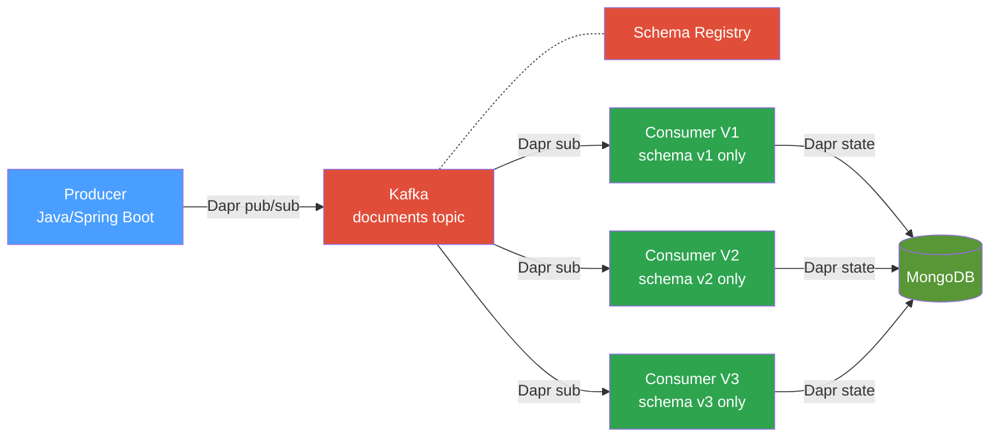
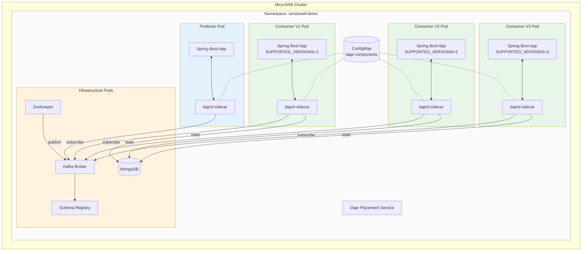
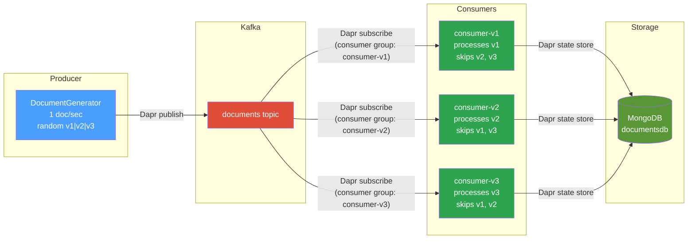
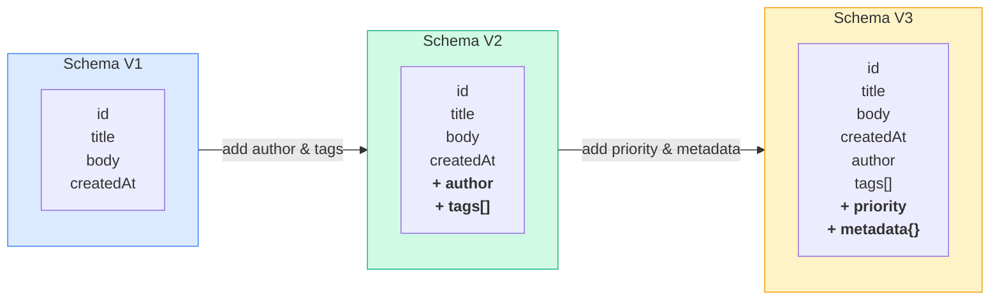
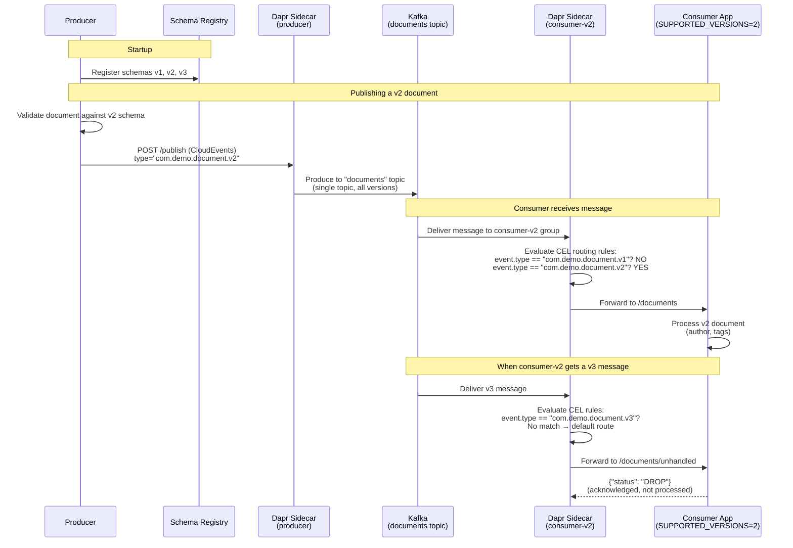
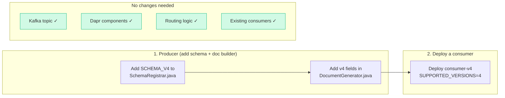
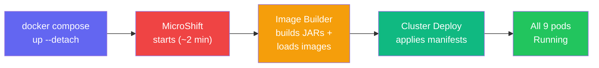
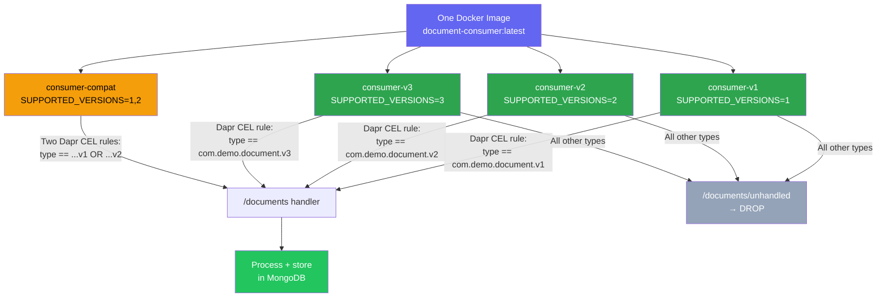
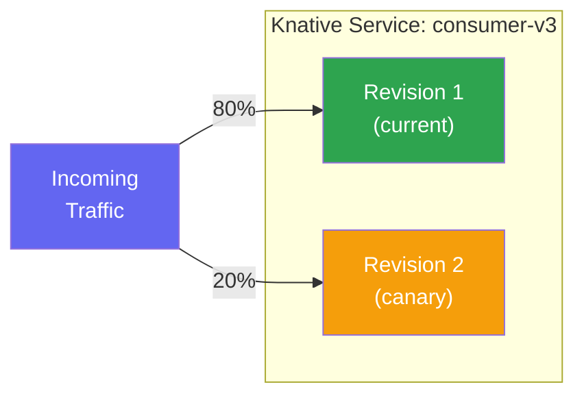

# Multi-Version Microservice Demo on Kubernetes

A self-contained demo showing how to run **multiple versioned microservices**
that handle evolving document schemas, using **Confluent Kafka**, **Dapr**,
**Knative**, **MongoDB**, and **MicroShift** (pure-Docker-Compose Kubernetes).

> **TL;DR** &mdash; `docker compose up --detach` and watch versioned consumers
> process documents with different schema versions in real time on a real
> Kubernetes cluster (MicroShift) &mdash; no tools to install besides Docker.

---

## The Problem

Schema evolution is one of the hardest operational challenges in event-driven
architectures. When a producer starts emitting a new payload version, you need
consumers that can handle it &mdash; without breaking the ones still processing
older versions. Typical solutions involve complex deployment choreography,
feature flags, or tightly coupled schema negotiation.

## The Solution

This demo uses **Dapr** for pub/sub abstraction and **Knative Serving** for
versioned service management to solve this cleanly:



- **Producer** generates 1 document/second with a randomly chosen schema
  version (v1, v2, or v3).
- **Three consumer instances** of the same Docker image each subscribe to the
  same Kafka topic via Dapr pub/sub. Each instance is configured (via
  `SUPPORTED_VERSIONS` env var) to process only its designated schema version.
- **Dapr** handles the messaging plumbing (Kafka pub/sub) and persistence
  (MongoDB state store) so the Java code stays framework-agnostic.
- **Knative** (on MicroShift) manages revisions, auto-scaling, and traffic
  splitting between consumer versions for canary/blue-green rollouts.
- **Schema Registry** stores the JSON schemas for documentation and validation.

---

## Architecture

### Deployment Pipeline

The entire stack is orchestrated by a single `docker compose up --detach`:

```mermaid
sequenceDiagram
    participant U as User
    participant DC as Docker Compose
    participant MS as MicroShift
    participant IB as Image Builder
    participant CD as Cluster Deploy

    U->>DC: docker compose up --detach
    DC->>MS: Start LVM + MicroShift container (8 GB)
    Note over MS: Kubernetes API server boots (~2 min)
    MS-->>DC: Healthy

    par Build & Load
        DC->>IB: Build producer & consumer JARs
        IB->>IB: docker build (Maven multi-stage)
        IB->>MS: podman load (producer + consumer)
        IB->>MS: podman load (Kafka, Mongo, Dapr, ZooKeeper, Schema Registry)
    end
    IB-->>DC: Done

    DC->>CD: Apply K8s manifests
    CD->>MS: Namespace + SCC binding
    CD->>MS: Dapr placement + components ConfigMap
    CD->>MS: ZooKeeper &#8594; Kafka &#8594; Schema Registry &#8594; MongoDB
    CD->>MS: Producer + Consumer v1/v2/v3 (with daprd sidecars)
    CD-->>DC: All pods Running

    Note over MS: Producer publishes 1 doc/sec<br/>Consumers process matching versions
```



### Pod Architecture Inside MicroShift

Each application pod runs two containers &mdash; the Java app and a Dapr sidecar:



### Message Flow



### Schema Evolution

Each schema version is additive &mdash; v3 is a superset of v2 which is a
superset of v1:



| Version | Fields | Example Processing |
|---------|--------|--------------------|
| **v1** | `id`, `title`, `body`, `createdAt` | Basic document logging |
| **v2** | v1 + `author`, `tags[]` | Author attribution, tag indexing |
| **v3** | v2 + `priority`, `metadata{source, region, correlationId}` | Priority routing, regional analytics |

The JSON schemas live in [`schemas/`](schemas/).

### How Smart Routing Works

This is the core mechanism — **not** topic-per-version, **not** naive
application-level filtering. All versions flow through a **single Kafka topic**
with routing handled by Dapr's CloudEvents-based content routing:



**Step by step:**

| Step | What | Where |
|------|-------|-------|
| 1 | Producer validates doc against JSON schema | `SchemaRegistrar.validate()` |
| 2 | Producer publishes CloudEvents with `type: com.demo.document.v{N}` | `DocumentGenerator.generate()` |
| 3 | All versions go to **single** Kafka topic `documents` | Dapr pub/sub component |
| 4 | Each consumer's Dapr sidecar evaluates **CEL routing rules** | `/dapr/subscribe` response |
| 5 | Matching messages → `/documents` (processed) | Dapr sidecar routing |
| 6 | Non-matching messages → `/documents/unhandled` → `DROP` | Dapr sidecar routing |

**The routing rules are auto-generated from config**, not hardcoded:

```java
// Consumer generates routing rules from SUPPORTED_VERSIONS env var
for (int v : supportedVersions) {
    rules.add(Map.of(
        "match", "event.type == \"com.demo.document.v" + v + "\"",
        "path", "/documents"
    ));
}
```

A consumer with `SUPPORTED_VERSIONS=1,2` generates rules for both v1 and v2,
making it a **backward-compatible multi-version consumer**.

### Adding a V4 Schema

To add a new schema version, you touch exactly **two things**:



- **No new Kafka topics** — v4 flows through the same `documents` topic
- **No Dapr config changes** — routing rules auto-generate from `SUPPORTED_VERSIONS`
- **No existing consumer changes** — they keep processing their versions, v4 messages get DROPped
- **Schema Registry** — v4 schema auto-registered on producer startup

---

## Quick Start

**Prerequisites:** Docker and Docker Compose (v2.20+).

```bash
# Clone with submodules
git clone --recurse-submodules https://github.com/righteouslabs/experiments-kubernetes.git
cd experiments-kubernetes

# Start everything — MicroShift + build + deploy, fully automated
docker compose up --detach

# Watch the deployment progress
docker compose logs -f cluster-deploy

# Once deployed, set up kubectl
export KUBECONFIG=$(pwd)/microshift-docker-compose/kubeconfig
kubectl -n versioned-demo get pods
```

That's it. One command brings up a full Kubernetes cluster with the entire
demo running inside it. No `kubectl`, `helm`, or `dapr` CLI needed.

### What Happens



### Watch the Logs

```bash
export KUBECONFIG=$(pwd)/microshift-docker-compose/kubeconfig

# Producer publishing documents
kubectl -n versioned-demo logs -l app=producer -c producer -f

# All consumers processing
kubectl -n versioned-demo logs -l app=consumer -c consumer -f
```

You'll see output like:
```
[seq=42] Published v2 document: id=abc-123 title="Order Created"
[consumer-v1] Processing v1 document: id=def-456 title="User Registered" [processed=12, skipped=30]
  v1 processing: basic document — title="User Registered"
[consumer-v2] Processing v2 document: id=abc-123 title="Order Created" [processed=15, skipped=27]
  v2 processing: author=alice, tags=[urgent, analytics]
[consumer-v3] Processing v3 document: id=ghi-789 title="Payment Processed" [processed=18, skipped=24]
  v3 processing: priority=HIGH, source=web, region=us-east-1
```

### Check Consumer Stats

Each consumer exposes a `/status` endpoint:

```bash
for v in v1 v2 v3; do
  kubectl -n versioned-demo exec deploy/consumer-$v -c consumer -- curl -s localhost:8080/status
done
```

```json
{"appName":"consumer-v1","supportedVersions":[1],"processedCount":49,"skippedCount":111}
{"appName":"consumer-v2","supportedVersions":[2],"processedCount":61,"skippedCount":99}
{"appName":"consumer-v3","supportedVersions":[3],"processedCount":50,"skippedCount":109}
```

### Standalone Mode (No Kubernetes)

Run the same demo as plain Docker containers with Dapr sidecars:

```bash
docker compose -f docker-compose.standalone.yml up --build
```

### Tear Down

```bash
docker compose down -v
```

---

## Project Structure

```
.
├── docker-compose.yml              # MicroShift + automated deployment
├── docker-compose.standalone.yml   # Plain Docker (no K8s) alternative
├── producer/                       # Java producer microservice
│   ├── Dockerfile
│   ├── pom.xml
│   └── src/main/java/com/demo/producer/
│       ├── ProducerApplication.java
│       └── DocumentGenerator.java
├── consumer-service/               # Java consumer (version-configurable)
│   ├── Dockerfile
│   ├── pom.xml
│   └── src/main/java/com/demo/consumer/
│       ├── ConsumerApplication.java
│       └── controller/SubscriptionController.java
├── dapr/components/                # Dapr component definitions (standalone)
│   ├── kafka-pubsub.yaml
│   └── mongodb-statestore.yaml
├── schemas/                        # JSON schemas for each document version
│   ├── document-v1.json
│   ├── document-v2.json
│   └── document-v3.json
├── k8s/                            # Kubernetes manifests
│   ├── namespace.yaml
│   ├── infrastructure/             # ZooKeeper, Kafka, Schema Registry, MongoDB
│   ├── dapr/                       # Dapr placement + components ConfigMap
│   ├── knative/                    # Knative Service definitions (reference)
│   └── services/                   # Producer + versioned consumers with daprd sidecars
├── scripts/                        # Helper scripts
└── microshift-docker-compose/      # Git submodule: MicroShift in Docker
```

## Key Technologies

| Component | Role |
|-----------|------|
| [Confluent Kafka](https://www.confluent.io/) | Event streaming backbone |
| [Schema Registry](https://docs.confluent.io/platform/current/schema-registry/) | Schema storage and validation |
| [Dapr](https://dapr.io/) | Pub/sub and state management sidecar |
| [Knative Serving](https://knative.dev/) | Serverless revision management and traffic splitting |
| [MongoDB](https://www.mongodb.com/) | Document persistence |
| [MicroShift](https://microshift.io/) | Lightweight Kubernetes (via Docker Compose) |
| Java 17 / Spring Boot 3 | Microservice runtime |

## How Versioned Services Work



The core pattern:

1. **One Docker image, many configurations** &mdash; The consumer service is
   built once. Each instance receives a `SUPPORTED_VERSIONS` env var that
   controls which schema versions its Dapr routing rules accept.

2. **CloudEvents type as version discriminator** &mdash; The producer sets
   `type: com.demo.document.v{N}` on every message. This is the field that
   drives all routing decisions.

3. **Dapr CEL routing rules** &mdash; Each consumer's `/dapr/subscribe`
   endpoint returns CEL match expressions auto-generated from `SUPPORTED_VERSIONS`.
   The Dapr sidecar evaluates these rules and only forwards matching messages
   to the application. Non-matching messages are DROPped at the sidecar level.

4. **Single Kafka topic** &mdash; All versions coexist on the `documents` topic.
   No topic-per-version. Schema Registry tracks each version as a subject
   for compatibility enforcement.

5. **Schema Registry enforcement** &mdash; The producer validates each document
   against its registered schema before publishing. Invalid documents are
   rejected before reaching Kafka.

6. **Knative manages service lifecycle** &mdash; In the Kubernetes deployment,
   Knative handles revision tracking, auto-scaling (including scale-to-zero),
   and traffic splitting between revisions for gradual rollouts.

This approach lets you:
- Deploy a new consumer version without touching existing ones
- Run multi-version consumers (`SUPPORTED_VERSIONS=1,2`) for backward compatibility
- Add a V4 by only adding the schema and deploying a consumer (no routing changes)
- Use Knative traffic splitting for canary deployments
- Decommission old versions by simply removing the deployment

### Knative Traffic Splitting (Canary Rollouts)

When deploying a new consumer revision, Knative can gradually shift traffic:



See [`k8s/knative/consumer-ksvc.yaml`](k8s/knative/consumer-ksvc.yaml) for
the Knative Service definitions with traffic splitting examples.

---

## OpenShift / MicroShift Notes

Running on MicroShift (OpenShift-based) requires a few accommodations that
are handled automatically by the deployer:

- **Security Context Constraints (SCCs)** &mdash; The `privileged` and
  `anyuid` SCCs are bound to the default service account so Confluent and
  MongoDB images can run as their expected UIDs.
- **`enableServiceLinks: false`** &mdash; Kubernetes injects env vars like
  `KAFKA_SERVICE_PORT` which Confluent images misinterpret as configuration
  properties. Disabling service links prevents this.
- **`securityContext.runAsUser: 0`** &mdash; Infrastructure pods
  (ZooKeeper, Kafka, Schema Registry) run as root to avoid file permission
  issues with the Confluent images.

---

## License

MIT
