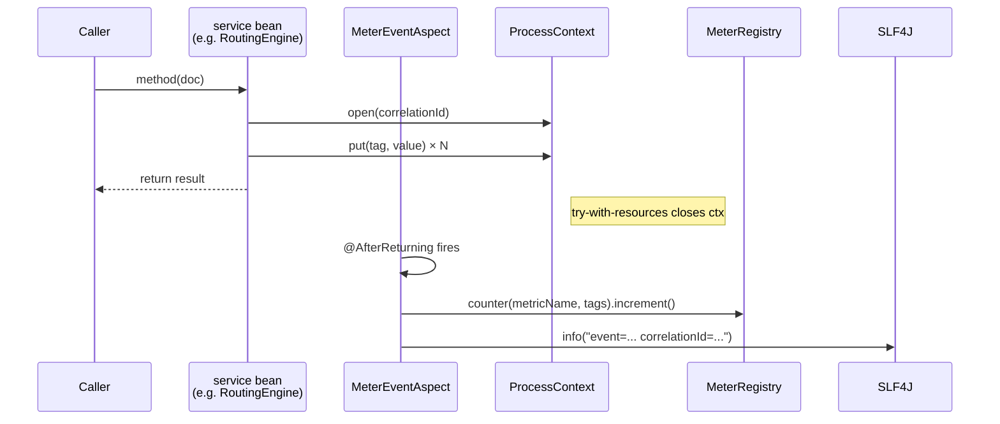

# commons-observability

A small shared library that turns scattered Micrometer calls, MDC
juggling and `Map<String, Object>` telemetry into three typed
annotations, one thread-local context, and one AspectJ advice class.
Every service in this repo depends on it; no service duplicates it.

## For POs

This library is the reason the Service Card can show "Decision Rules"
and "KPIs" live, without a build — the `@BusinessRule` and
`@MeterEvent` annotations the developers attach to each Function body
are read at runtime and projected to JSON.

You will never need to open Java to benefit from the library. You may
want to know that:

- Every declared KPI becomes a Prometheus counter, visible in Grafana.
- Every declared business rule becomes a row on the Service Card.
- Tag allow-lists prevent a runaway input (e.g. a correlation id used
  as a tag) from exploding metric cardinality — outside the list, the
  value is recorded as `OTHER`.

## For Developers

### Parts list

| File                                                                        | Role                                                                        |
|-----------------------------------------------------------------------------|-----------------------------------------------------------------------------|
| [`@MeterEvent`](./src/main/java/com/demo/commons/observability/MeterEvent.java)             | Method annotation — "count this event on return".                           |
| [`@Tick`](./src/main/java/com/demo/commons/observability/Tick.java)                         | Method annotation — "tick these auxiliary counters on return".              |
| [`@BusinessRule`](./src/main/java/com/demo/commons/observability/BusinessRule.java) / [`@BusinessRules`](./src/main/java/com/demo/commons/observability/BusinessRules.java) | Metadata only — documents a decision; rendered on the Service Card.         |
| [`EventCatalogEntry`](./src/main/java/com/demo/commons/observability/EventCatalogEntry.java) | Interface each service's event enum implements — one constant per event.    |
| [`TagDescriptor`](./src/main/java/com/demo/commons/observability/TagDescriptor.java)         | Interface each service's tag enum implements — one constant per tag.        |
| [`ProcessContext`](./src/main/java/com/demo/commons/observability/ProcessContext.java)       | Try-with-resources bag of tag values, scoped to one invocation.             |
| [`MeterEventAspect`](./src/main/java/com/demo/commons/observability/MeterEventAspect.java)   | The advice that fires counters + structured logs + tag allow-lists.          |
| [`ServiceCardSupport`](./src/main/java/com/demo/commons/observability/ServiceCardSupport.java) | Shared projections (rules, kpis, wiring) for `/servicecard.json`.          |
| [`CloudEventEnvelope`](./src/main/java/com/demo/commons/observability/CloudEventEnvelope.java) | One-call helper to strip CloudEvents 1.0 envelopes in Jackson deserializers. |

### How a single `@MeterEvent` call fans out


*The Function body remains declarative; the aspect adds the counter + log after every successful call.*

### Adding a new event to a service

1. Add a constant to the service's `EventCatalogEntry` enum:

    ```java
    DOCUMENT_QUARANTINED(
        "document.quarantined",                                     // metric name
        "observability.enrichment.quarantined.log.enabled",         // log toggle
        "observability.enrichment.quarantined.metric.enabled",      // metric toggle
        true);                                                      // auditable
    ```

2. Make sure the enum is exposed as a
   `Map<String, EventCatalogEntry>` bean (each service already has
   an `@Configuration` that does this — e.g. `EnrichmentConfig`).
3. Annotate the method that "emits" the event:

    ```java
    @MeterEvent("DOCUMENT_QUARANTINED")
    public Decision quarantine(Document doc) { ... }
    ```

4. (Optional) Add plain-English rules for the Service Card:

    ```java
    @BusinessRule(condition = "priority == LOW && score < 30", outcome = "quarantine")
    ```

Done. Counter, structured log, and Service Card row all light up
without touching any infrastructure code.

### Configuration

Every event's metric and log emission is toggleable. Defaults are
**on**; override in `application.yml`:

```yaml
observability:
  enrichment:
    document-enriched:
      metric:
        enabled: true
      log:
        enabled: true
  tags:
    grade:
      allow: A,B,C        # values outside → "OTHER"
```

### Tag-cardinality allow-list

For each `TagDescriptor`, the aspect reads
`observability.tags.<name>.allow` from the Spring `Environment` at
startup. If the list is empty, there's no guard. If non-empty, any
value outside the list is replaced with the string `"OTHER"` before
being emitted as a Micrometer tag — the single most effective defense
against metric cardinality explosions. The Grafana dashboards still
work because `OTHER` is a deterministic bucket.

### What the library does **not** do

- No logging framework bindings. `slf4j-api` is compile-only; the
  consuming service picks the backend.
- No Spring Boot autoconfiguration. Each service wires the
  `ServiceCardSupport` helpers and `Map<String, EventCatalogEntry>`
  bean explicitly — fewer surprises than classpath-driven autoconfig.
- No opinions on distributed tracing. The `ProcessContext`
  correlationId is enough for the demo; plug in OpenTelemetry
  bindings externally if you need end-to-end traces.

### Using it in a new service

Add a `includeBuild` in your `settings.gradle` plus a plain
implementation dependency:

```gradle
// settings.gradle
includeBuild('../commons-observability') {
    dependencySubstitution {
        substitute module('com.demo:commons-observability') using project(':')
    }
}

// build.gradle
implementation 'com.demo:commons-observability:1.0.0'
implementation 'org.springframework.boot:spring-boot-starter-aop'
```

Define your event/tag enums, expose them as beans, annotate methods.
Use the `ServiceCardSupport` helpers in your `ServiceCardController`.
Copying from the document-enricher or the package-router gives a
working template in under 50 LOC.
