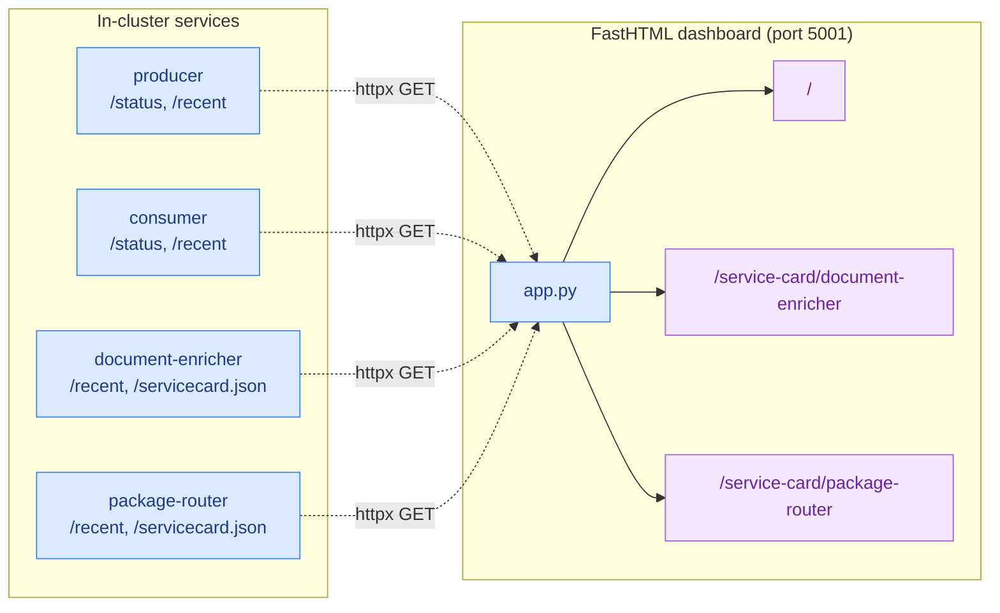

# Dashboard — Live Pipeline + Service Cards

A [FastHTML](https://fastht.ml/) app that polls each service's
`/status`, `/recent`, and `/servicecard.json` endpoints and renders
three views: the live pipeline, the document-enricher Service Card,
and the package-router Service Card.

## For POs

Open [http://localhost:30501](http://localhost:30501) after
`docker compose up --build --detach` finishes.

- **Pipeline dashboard** (`/`) — live-refreshes every 3 seconds:
  - Producer and consumer live counts.
  - Schema Registry subjects with version counts.
  - Correlation-id matching that colour-codes rows so you can trace a
    single message from producer to consumer to enricher.
- **Service Card: document-enricher** (`/service-card/document-enricher`) —
  pipeline, decision rules, KPIs, sample I/O, wiring — projected live
  from the service.
- **Service Card: package-router** (`/service-card/package-router`) —
  same shape as above **plus** the full DMN table rendered as a
  spreadsheet, the "Included Models" pill showing `commons` types,
  and the 8 PO-authored test scenarios with pass markers.

## For Developers

### How it works

*All data is fetched live via the in-cluster DNS hostnames (resolved through the NodePort for external services).*

### Routes

| Route                                 | What it renders                                                                                   |
|---------------------------------------|---------------------------------------------------------------------------------------------------|
| `/`                                   | Live pipeline view (auto-refresh every 3s via HTMX `hx-get="/live"`)                              |
| `/live`                               | HTMX-swappable fragment: summary bar, schema registry card, recent activity, low-code stage table |
| `/service-card/document-enricher`     | PO-facing Service Card for the Phase 1 enricher                                                   |
| `/service-card/package-router`        | PO-facing Service Card for the Phase 2 router, **with** the DMN table + scenarios                 |
| `/lowcode-docs/`                      | Pre-rendered AsyncAPI HTML bundle (generated by `lowcode-scf/generate-docs.sh`) — fallback to raw YAML if missing |

### Environment variables

| Variable                | Default                                                              | Purpose                                       |
|-------------------------|----------------------------------------------------------------------|-----------------------------------------------|
| `CONSUMER_URL`          | `http://consumer:8080`                                               | Phase 0 consumer                              |
| `PRODUCER_URL`          | `http://producer:8080`                                               | Phase 0 producer                              |
| `ENRICHER_URL`          | `http://document-enricher:8080`                                      | Phase 1 enricher                              |
| `ROUTER_URL`            | `http://package-router:8080`                                         | Phase 2 router                                |
| `SCHEMA_REGISTRY_URL`   | `http://schema-registry:8081`                                        | Confluent Schema Registry                     |
| `GRAFANA_URL`           | `http://localhost:3000`                                              | Grafana link (user-facing, not polled)        |

In cluster the FQDNs `*.versioned-demo.svc.cluster.local` override
these via the Deployment env — see
[`k8s/services/dashboard.yaml`](../k8s/services/dashboard.yaml).

### Styling

The amber gradient header + manufacturing palette is defined inline in
`SERVICE_CARD_CSS` at the top of `app.py`. The colour tokens (`--sc-*`)
are the same ones used on the PO-focused sections of the pipeline view,
so the two pages feel like the same product.

### Adding a new Service Card

1. In the target service, implement `GET /servicecard.json` with the
   same shape as the others (pipeline, rules, kpis, samples, wiring —
   plus any extra section like `dmn`).
2. Add a `fetch_service_card(NEW_URL)` + `_render_service_card` call
   as a new `@rt(...)` handler.
3. `_render_service_card` is generic — it renders any section listed
   in `children`. Add a new small `_render_<section>` helper when the
   service exposes a new kind of data.
