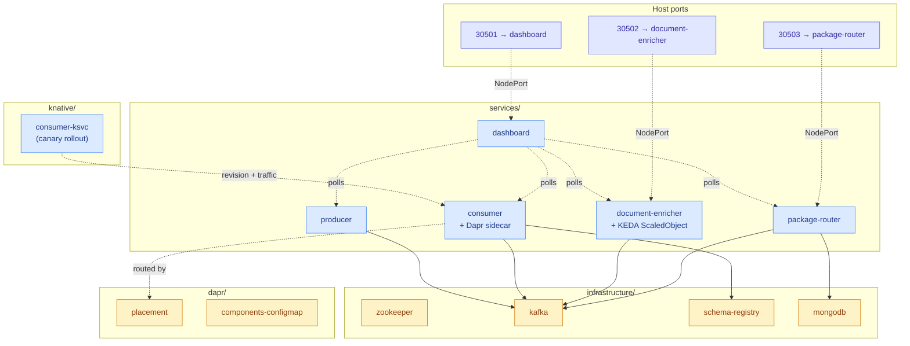

# Kubernetes Manifests

All resources live in the `versioned-demo` namespace. Applied in order
by the `cluster-deploy` step of the root `docker-compose.yml`.

## For Developers / Ops

*Deployment topology: one namespace, five app Deployments, four infra Deployments, three NodePort bridges to the host.*

## Folder layout

| Folder                                 | What it contains                                                                               |
|----------------------------------------|------------------------------------------------------------------------------------------------|
| [`namespace.yaml`](./namespace.yaml)   | The `versioned-demo` namespace.                                                                |
| [`infrastructure/`](./infrastructure/) | Kafka + Zookeeper + Schema Registry (`kafka.yaml`) and MongoDB (`mongodb.yaml`).               |
| [`dapr/`](./dapr/)                     | Dapr `placement` Deployment + the `components` ConfigMap (Kafka pubsub, Mongo state store).    |
| [`services/`](./services/)             | Producer, consumer, document-enricher (+ KEDA), package-router, dashboard.                     |
| [`knative/`](./knative/)               | `consumer-ksvc.yaml` — demonstrates revisions + traffic splitting; overlaps `services/consumer.yaml`. |

## Apply order (as run by the compose deployer)

1. `namespace.yaml` + permissive pod-security labels + SCC binds.
2. `dapr/` — placement service + components ConfigMap.
3. `infrastructure/` — wait for Zookeeper → Kafka → Schema Registry → MongoDB.
4. `services/producer.yaml`.
5. `services/consumer.yaml` (plain Deployment). The Knative Service in
   `knative/consumer-ksvc.yaml` is an alternate — pick one.
6. `services/document-enricher.yaml` (with KEDA best-effort install).
7. `services/package-router.yaml`.
8. `services/dashboard.yaml`.

## NodePort map

| Port on host | Service              | Why                                                                       |
|--------------|----------------------|---------------------------------------------------------------------------|
| 30501        | dashboard (5001)     | Browser-facing UI.                                                        |
| 30502        | document-enricher    | External Prometheus scrape; also usable for manual actuator calls.        |
| 30503        | package-router       | External Prometheus scrape + `/servicecard.json` for the dashboard proxy. |

## Resource footprint (requests / limits)

| Service              | Request mem | Limit mem |
|----------------------|-------------|-----------|
| consumer             | 256Mi       | 384Mi     |
| producer             | 256Mi       | 384Mi     |
| document-enricher    | 256Mi       | 512Mi     |
| package-router       | 256Mi       | 512Mi     |
| dashboard            | 64Mi        | 128Mi     |
| kafka + zookeeper    | see `infrastructure/kafka.yaml`                  |
| mongodb              | see `infrastructure/mongodb.yaml`                |

MicroShift itself gets 12Gi in the root `docker-compose.yml` — enough
to run the lot on a developer laptop.

## KEDA note

`document-enricher.yaml` includes a `ScaledObject` that scales the
Deployment 1 → 3 based on consumer-group lag on `documents`
(threshold 100). The deployer attempts to install KEDA
(`keda-2.14.0.yaml`); if that fails, the ScaledObject apply is
tolerated and the Deployment still runs.

## Knative note

`knative/consumer-ksvc.yaml` demonstrates the revision + traffic-split
pattern for the multi-version consumer. It is **not** applied by the
default deployer; apply it manually after stopping the plain
`consumer` Deployment.
