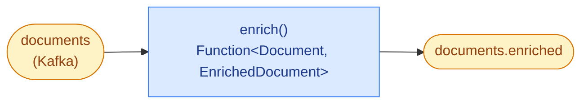

# Document Enricher — Spring Cloud Function + AsyncAPI

A Kafka-to-Kafka enrichment service whose business logic is a single
Function bean. `documents` in, `documents.enriched` out. Everything
else — Kafka I/O, JSON (de)serialization, retries, counters, health
probes, autoscaling — is delegated to a framework.

## For POs

- **What it does:** reads inbound document records, attaches a
  deterministic quality score (`qualityScore`) and a one-letter
  inspection grade (`inspectionGrade`, A/B/C), then republishes the
  enriched record.
- **Where the logic lives:** in the method
  [`EnrichmentEngine#apply`](./src/main/java/com/demo/enricher/EnrichmentEngine.java),
  with the decision rules declared above it as `@BusinessRule`
  annotations — rendered live on the Service Card at
  [http://localhost:30501/service-card/document-enricher](http://localhost:30501/service-card/document-enricher).
- **Where the contract lives:** in [`asyncapi.yaml`](./asyncapi.yaml).
  Regenerate the HTML docs with `./generate-docs.sh`; they ship at
  `/lowcode-docs/` on the dashboard.

## For Developers


*The pipeline: Kafka → Function → Kafka. No client code in between.*

### The whole service

```java
@SpringBootApplication(scanBasePackages = { "com.demo.enricher", "com.demo.commons" })
public class EnricherApplication {

    private final EnrichmentEngine engine;
    public EnricherApplication(EnrichmentEngine engine) { this.engine = engine; }

    public static void main(String[] args) {
        SpringApplication.run(EnricherApplication.class, args);
    }

    @Bean
    public Function<Document, EnrichedDocument> enrich() {
        return engine::apply;          // Spring Cloud Stream wires this to Kafka
    }
}
```

`EnrichmentEngine#apply` is ~15 lines of real work — score → grade →
assemble the output record. The `@MeterEvent` and `@BusinessRule`
annotations turn each call into:

- a Micrometer counter increment (`enrichment.outcome{grade=...}`),
- a structured log line with the correlation id,
- a row on the Service Card's Decision Rules table.

### What the frameworks contribute

| Concern                        | Framework                                     |
|--------------------------------|-----------------------------------------------|
| Kafka consume/produce          | Spring Cloud Stream Kafka binder              |
| JSON ↔ record (with unwrap)    | Jackson + `CloudEventUnwrappingDeserializer`  |
| Consumer group + retries       | Declared in `application.yml`                 |
| Counters + structured logs     | `commons-observability` `MeterEventAspect`    |
| HTTP endpoints + health probes | Spring Boot Actuator                          |
| Prometheus scraping            | `/actuator/prometheus` + Micrometer registry  |
| Kafka-lag autoscaling          | KEDA `ScaledObject` in `k8s/services/`        |
| Service Card JSON              | `ServiceCardController` + `ServiceCardSupport`|

### Files

| File                                                                                        | What it is                                                                        |
|---------------------------------------------------------------------------------------------|-----------------------------------------------------------------------------------|
| [`asyncapi.yaml`](./asyncapi.yaml)                                                          | The source of truth for the Kafka contract                                        |
| [`EnricherApplication.java`](./src/main/java/com/demo/enricher/EnricherApplication.java)    | `main()` + the Function bean + `GET /recent`                                      |
| [`EnrichmentEngine.java`](./src/main/java/com/demo/enricher/EnrichmentEngine.java)          | The per-message work (scoring, grading, timing)                                   |
| [`ServiceCardController.java`](./src/main/java/com/demo/enricher/ServiceCardController.java) | `GET /servicecard.json`                                                           |
| [`Document`](./src/main/java/com/demo/enricher/Document.java) / [`EnrichedDocument`](./src/main/java/com/demo/enricher/EnrichedDocument.java) | Typed records, Jackson-friendly                                              |
| [`CloudEventUnwrappingDeserializer.java`](./src/main/java/com/demo/enricher/CloudEventUnwrappingDeserializer.java) | Strips the Dapr CE envelope when present (shared helper in commons)               |
| [`application.yml`](./src/main/resources/application.yml)                                   | SCS bindings, Kafka binder, Actuator exposure, observability toggles              |
| [`build.gradle`](./build.gradle) / [`settings.gradle`](./settings.gradle)                   | Spring Boot 3.4 + Spring Cloud 2024 + `includeBuild '../commons-observability'`   |
| [`Dockerfile`](./Dockerfile) / [`Makefile`](./Makefile) / [`generate-docs.sh`](./generate-docs.sh) | Image build + AsyncAPI HTML regeneration                                  |

### KPIs emitted

| Meter                                   | Type       | Tags                                 |
|-----------------------------------------|------------|--------------------------------------|
| `enrichment.outcome`                    | counter    | `grade`, `schemaVersion`, `priority` |
| `enrichment.latency`                    | timer p50/95/99 | —                                |
| `spring.cloud.stream.binder.kafka.*`    | binder-native | —                                 |
| `jvm.memory.used`, `jvm.threads.live`   | gauge      | Actuator                             |

Tag allow-lists (in `application.yml` →
`observability.tags.<name>.allow`) cap Micrometer cardinality: any
value outside the list is recorded as `OTHER`.

### Regenerate the AsyncAPI docs

```bash
./generate-docs.sh        # or `make docs`
# Output: ./public/index.html (served at /lowcode-docs/ by the dashboard)
```

### Why not Dapr / Knative here?

Phase 0 already demonstrates Dapr's content-based routing and Knative's
revision/traffic management. For a simple consume-transform-publish
pipeline, SCS + `Function<T,R>` + KEDA reaches a higher code-to-value
ratio. Both approaches belong in the toolbox.

### Service Card

[http://localhost:30501/service-card/document-enricher](http://localhost:30501/service-card/document-enricher)
— pipeline, rules, KPIs, sample in/out, REST + Kafka wiring.
