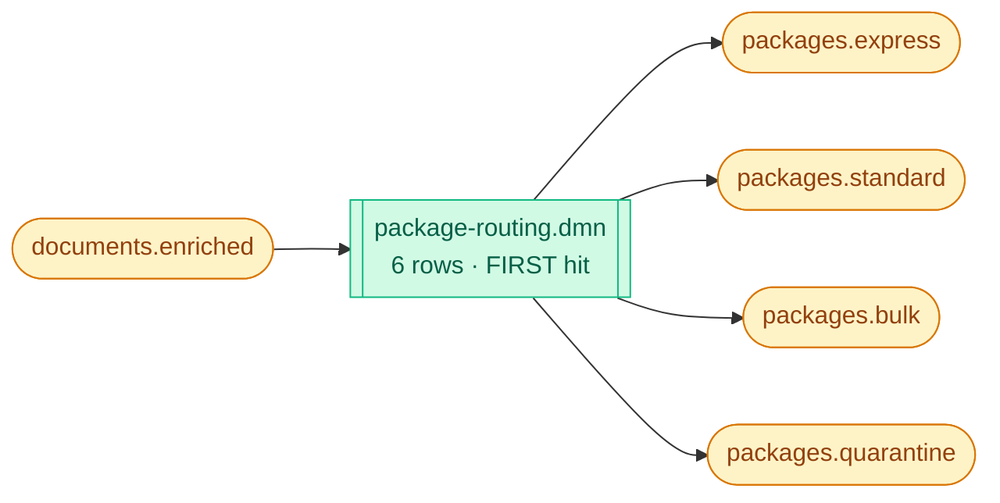
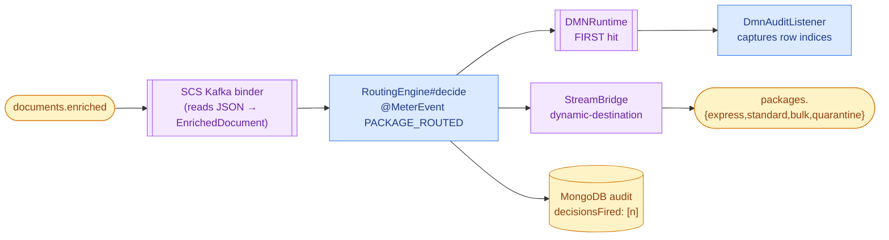
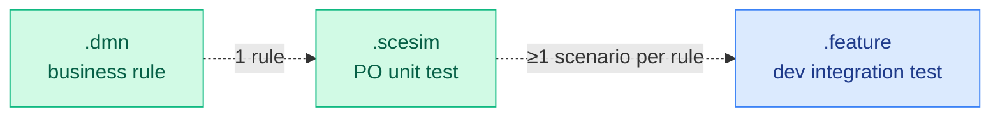

# Package Router — DMN Decision Table as Source of Truth

A Kafka-to-Kafka routing service whose business logic is a six-row
DMN decision table edited directly by Product Owners. The Java service
is a ~75-line carrier around a Kogito / Apache KIE `DMNRuntime`.

## For POs

**The [decision table](./src/main/resources/dmn/package-routing.dmn) IS
the business logic.** Open it in VS Code (Red Hat DMN Editor
extension) or at [sandbox.kie.org](https://sandbox.kie.org). The live
service reloads the table at boot — a PR that changes a row ships as a
new image, without a developer touching Java.


*The pipeline: one input, six rules, four possible destinations.*

**The live rendering of the table** is on the Service Card:
[http://localhost:30501/service-card/package-router](http://localhost:30501/service-card/package-router).
It shows the current hit policy, every rule, the imported shared
types, and the 8 PO-authored test scenarios with pass/fail markers.

The [`dmn/` README](./src/main/resources/dmn/README.md) has the full
editor setup + "can I add a new rule?" FAQ for POs.

## For Developers


*Request-time flow: blue = service code, purple = framework, amber = infrastructure.*

### The whole Function body

```java
@Bean
public Consumer<EnrichedDocument> route() {
    return doc -> {
        try {
            RoutingDecision decision = engine.decide(doc);
            ledger.record(doc, decision);
            bridge.send(decision.outputTopic(), doc);
        } catch (Exception e) {
            log.error("router.failed correlationId={} error={}",
                      doc.correlationId(), e.getMessage(), e);
        }
    };
}
```

`engine.decide(doc)` populates a DMN context with `priority`,
`bodyLength`, `enrichmentGrade`, evaluates the `package-routing` model,
and returns the topic + SLA + reason the DMN produced.

### Audit capture — one listener, zero business-logic intrusion

```java
@Component
public class DmnAuditListener implements DMNRuntimeEventListener {
    @Override
    public void afterEvaluateDecisionTable(AfterEvaluateDecisionTableEvent event) {
        // Stash matched 1-based row indices per-thread
        // so RoutingEngine can harvest them after evaluateAll().
    }
}
```

The Kogito DMN starter auto-detects Spring-managed beans implementing
this interface. When the runtime fires a table, the listener records
`[2]` (or `[2, 4]` for multi-hit policies) and `AuditLedger` writes it
into Mongo's `audit` collection.

### Three-layer test pattern


*Each layer covers what the previous layer cannot — see [`src/test/README.md`](./src/test/README.md).*

### Files

| File                                                                                   | What it is                                                                      |
|----------------------------------------------------------------------------------------|---------------------------------------------------------------------------------|
| [`dmn/package-routing.dmn`](./src/main/resources/dmn/package-routing.dmn)              | The 6-row decision table — **PO source of truth**                               |
| [`dmn/commons-types.dmn`](./src/main/resources/dmn/commons-types.dmn)                  | Shared itemDefinitions (Document, EnrichedDocument, PackageRoute)               |
| [`dmn/package-routing.scesim`](./src/main/resources/dmn/package-routing.scesim)        | PO-authored test grid — 8 scenarios                                             |
| [`RouterApplication.java`](./src/main/java/com/demo/router/RouterApplication.java)     | Bootstrap + `@Bean Consumer<EnrichedDocument> route()`                          |
| [`RoutingEngine.java`](./src/main/java/com/demo/router/RoutingEngine.java)             | Opens the process context, evaluates DMN, picks outputs                         |
| [`DmnRuntimeConfig.java`](./src/main/java/com/demo/router/DmnRuntimeConfig.java)       | Builds the `DMNRuntime` bean from `classpath*:dmn/*.dmn`                        |
| [`DmnAuditListener.java`](./src/main/java/com/demo/router/DmnAuditListener.java)       | Captures which rows fired                                                       |
| [`AuditLedger.java`](./src/main/java/com/demo/router/AuditLedger.java)                 | Writes per-decision audit records to MongoDB                                    |
| [`DmnTableParser.java`](./src/main/java/com/demo/router/DmnTableParser.java)           | Parses the .dmn XML at startup for the Service Card                             |
| [`ScesimParser.java`](./src/main/java/com/demo/router/ScesimParser.java)               | Parses the .scesim XML for the Service Card                                     |
| [`ServiceCardController.java`](./src/main/java/com/demo/router/ServiceCardController.java) | `GET /servicecard.json`                                                         |
| [`features/package-routing.feature`](./src/test/resources/features/package-routing.feature) | Dev integration test — Kafka + Micrometer + MongoDB assertions                  |

### KPIs emitted

| Meter                   | Type     | Tags                                             |
|-------------------------|----------|--------------------------------------------------|
| `package.routed`        | counter  | `topic`, `priority`, `grade`, `routing_reason`   |
| `routing.latency`       | timer p50/95/99 | —                                          |

Cardinality of every tag is capped by an allow-list in
`application.yml` under `observability.tags.<name>.allow`. Values
outside the list are recorded as `OTHER`.

### Why this shape?

- **`Consumer` not `Function`.** SCS publishes a `Function`'s return
  value to a single fixed output binding — here we need the
  destination topic to depend on the payload, so we use a
  `StreamBridge` inside a `Consumer`.
- **A listener, not a return value.** DMN could return the row
  indices, but a `DMNRuntimeEventListener` is a zero-intrusion way to
  capture them — and works identically for multi-hit policies later.
- **MongoDB, not Kafka, for audit.** An audit record is a query target,
  not a stream — we expect `find({correlationId})` and
  `aggregate(group by topic)` far more often than we expect to replay.

### Rough edges we do not hide

- The DMN `Document` type in `commons-types.dmn` does not model `tags`
  or `metadata`. DMN 1.5 can't cleanly express the v2-vs-v3 `tags`
  shape divergence (`List<String>` vs `List<Map<String,Object>>`), and
  `metadata` is untyped by design.
- The `.feature` file is a layering demonstration, not a runnable
  test. A production build would add a Testcontainers Kafka + MongoDB
  fixture.
- `DmnRuntimeConfig` hand-builds the `DMNRuntime` because the Kogito
  10.x Spring Boot starter isn't yet on Maven Central. Swap for
  `@EnableKogito` when it lands.
