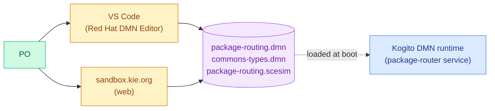

# Business Logic — Source of Truth

This folder holds the routing rules and the PO-owned test plan for the
package-router service. Every file here is hand-authored and edited by
Product Owners. No Java needs to change for a rule tweak.

## For POs

**What lives in this folder.**

| File                                                          | What it is                                                                                   | You edit it?                         |
|---------------------------------------------------------------|----------------------------------------------------------------------------------------------|--------------------------------------|
| [`package-routing.dmn`](./package-routing.dmn)                | The six-row decision table — priority + bodyLength + grade → topic + SLA + reason           | YES — add, edit, re-order rows       |
| [`commons-types.dmn`](./commons-types.dmn)                    | Shared data types: `Document`, `EnrichedDocument`, `PackageRoute`                            | YES — add fields, tighten enums      |
| [`package-routing.scesim`](./package-routing.scesim)          | The test plan: 8 scenarios (one per rule + edge cases)                                       | YES — add a scenario when you add a rule |

*Edit either in VS Code or the web sandbox — both write the same XML the runtime reads.*

### How to open the files

**Option A — VS Code.** Install the Red Hat "Extension Pack for Apache
KIE" (bundle 10.1+). Double-click `package-routing.dmn` to open the
graphical editor. Three tabs:

- **DRD (default)** — the diagram with one decision node and three
  inputs.
- **Data Types** — the `commons.*` types imported from
  `commons-types.dmn`. These are read-only in the importing file; edit
  them from `commons-types.dmn` instead.
- **Included Models** — confirms the import resolved. If the badge
  shows "missing", the `locationURI` is wrong.

Double-click the decision node to edit the table.

**Option B — [sandbox.kie.org](https://sandbox.kie.org).** Drag the
three files onto the sandbox, open `package-routing.dmn`. Same tabs,
no install.

### The six rules

The FIRST hit policy means the top-most matching row wins. Rule 6 is
the fallback — it matches everything and sends unmatched messages to
`packages.quarantine` for manual review.

| # | priority  | bodyLength | grade   | → topic                | SLA (min) | reason                                  |
|---|-----------|------------|---------|------------------------|-----------|-----------------------------------------|
| 1 | `"HIGH"`  | —          | `"A"`   | `packages.express`     | 5         | Top priority + top grade                |
| 2 | `"HIGH"`  | `> 500`    | `"B","C"` | `packages.express`   | 10        | High priority with substantial payload  |
| 3 | `"NORMAL"`| `< 200`    | `"A","B"` | `packages.standard`  | 30        | Standard flow                           |
| 4 | `"NORMAL"`| `>= 200`   | `"A","B","C"` | `packages.bulk`  | 60        | Bulk routing for larger payloads        |
| 5 | `"LOW"`   | —          | `"A","B","C"` | `packages.bulk`  | 240       | Low priority - batched                  |
| 6 | —         | —          | —       | `packages.quarantine`  | null      | Fallback - needs review                 |

### FAQ

**Q: Can I add a new rule?**
A: Yes. In the editor, click the decision table, add a row, fill the
six cells. Before you merge, add a matching scenario in
`package-routing.scesim` — one row per rule keeps the unit coverage
complete. CI checks that the .scesim still passes; a failing scenario
means the new rule disagrees with your own expectation.

**Q: Can I change a data type?**
A: Shared types (`Document`, `EnrichedDocument`, `PackageRoute`) live
in `commons-types.dmn`. Edit them there. `package-routing.dmn` pulls
them in via `<import name="commons" />`, so an update flows
automatically on the next build. For service-specific types, add them
to `package-routing.dmn` directly.

**Q: How do I test my change before merging?**
A: Open `package-routing.scesim` in the same editor. It shows a grid
of scenarios and a green "Run" button. Click Run; every scenario that
matches your new rule lights up green (or red, if it doesn't). Fix
until green, commit, push. CI re-runs on the server.

**Q: Can I preview the Service Card locally?**
A: Yes. `docker compose up --build --detach`, wait for
"All services deployed successfully", then open
[http://localhost:30501/service-card/package-router](http://localhost:30501/service-card/package-router).
It renders the table exactly as the editor shows it, plus the
scenarios with pass markers.

**Q: What's the diff between "decision table" and "DMN"?**
A: DMN is the notation (an OMG spec). A decision table is one kind of
DMN node — the one where each row is a rule. DMN also has "boxed
expressions", "decision services", etc. We only use decision tables
here because they are the simplest, cleanest PO-facing artefact.

### Things to know / rough edges

- **`tags` and `metadata` aren't in `commons-types.dmn`.** The `tags`
  field has incompatible shapes across schema versions (string array
  vs object array), and DMN 1.5 can't express that cleanly. The
  router doesn't look at either field anyway.
- **Import namespace is pinned to DMN 1.4.** See the big comment at
  the top of `package-routing.dmn` — that's the only URI that keeps
  both the VS Code editor (DMN 1.5-aware) and the Drools runtime
  (DMN 1.4 importer) happy simultaneously.
- **An empty DMN diagram (`<DMNDI/>`) is valid** for a types-only
  file. The editor otherwise shows an "Empty Diagram" prompt.

## For Developers

The `DmnTableParser` (see sibling Java folder) reads this XML at
startup and projects it into the Service Card. The `DmnRuntimeConfig`
hands these resources to Apache KIE's `DMNRuntimeBuilder`, which is
what actually evaluates the rules at request time.

Nothing in this folder should reference service-specific topics or
Java class names — it is meant to be portable. Adding a second routing
service (e.g. "incident-router.dmn") is a matter of copying the shape
and giving it a new namespace.
