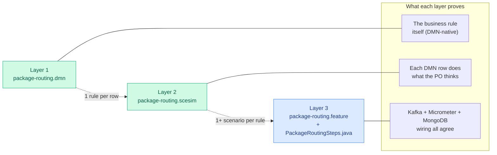

# package-router testing — three layers, three owners

Tests are stratified by role and authoring format. Each layer proves
something the previous layer cannot.

## For Developers

*Green = Product Owner authored. Blue = Developer authored.*

| Layer            | What it proves                                         | File                                                   | Author        | Runtime                        |
|------------------|--------------------------------------------------------|--------------------------------------------------------|---------------|--------------------------------|
| 1. Rule          | Business intent                                        | [`dmn/package-routing.dmn`](../main/resources/dmn/package-routing.dmn) | Product Owner | Kogito DMN at service startup  |
| 2. Unit          | Each DMN row does what the PO thinks                   | [`dmn/package-routing.scesim`](../main/resources/dmn/package-routing.scesim) | Product Owner | Kogito SCESIM runner (in CI)   |
| 3. Integration   | Surrounding Kafka / Micrometer / MongoDB behave        | [`features/package-routing.feature`](./resources/features/package-routing.feature) + [`PackageRoutingSteps.java`](./java/com/demo/router/steps/PackageRoutingSteps.java) | Developer     | Serenity BDD + Cucumber        |

## Why three layers

A decision-table change is only safe if **both** the rule behaviour
and the surrounding observability contract hold.

- The `.scesim` covers pure FEEL evaluation — fast, PO-native, no
  Kafka broker required. It's the first-class PO unit-test format,
  edited in the same VS Code grid as the .dmn.
- The `.feature` file covers orchestration — Kafka delivery, dynamic
  output topics, Micrometer counter tags, MongoDB audit writes. A
  failing integration step tells the dev "the DMN evaluates correctly
  but the wiring is wrong". A failing scesim row tells the PO "the
  DMN rule itself disagrees with my intent".

## How to turn a .scesim row into a .feature scenario

1. Open `package-routing.scesim` in VS Code; pick a row.
2. Copy its inputs (`priority`, `bodyLength`, `enrichmentGrade`) and
   expected outputs (`expectedTopic`, `expectedSlaMinutes`,
   `expectedReason`) into a new `Scenario:` inside
   `features/package-routing.feature`.
3. Add the cross-service assertions the scesim can't express:
   - Which Micrometer counter series should tick, with which tag
     values (`topic=`, `priority=`, `grade=`, `routing_reason=`).
   - Which Mongo `audit` collection record should appear and what its
     `decisionsFired` array should contain.
4. Leave the step-definition vocabulary alone — the skeletons in
   `PackageRoutingSteps.java` already cover the verbs.

## Status

The Serenity feature file and the step-definition skeletons in
`steps/` are **demo-only**. They document the pattern; they are NOT
wired to the Gradle test task. A production build would add:

- `@CucumberOptions` runner class.
- Testcontainers Kafka + MongoDB fixture.
- `KafkaTemplate` step that publishes the `EnrichedDocument` and waits
  for the output topic via a `KafkaConsumer` with a short poll budget.
- Prometheus scrape step using Spring's `TestRestTemplate` against
  `/actuator/prometheus`.

## Banned-term sanity check

Before committing any change under `package-router/`, run the project
banned-term audit (see repo root). Client-specific vocabulary must
not leak into the codebase.
